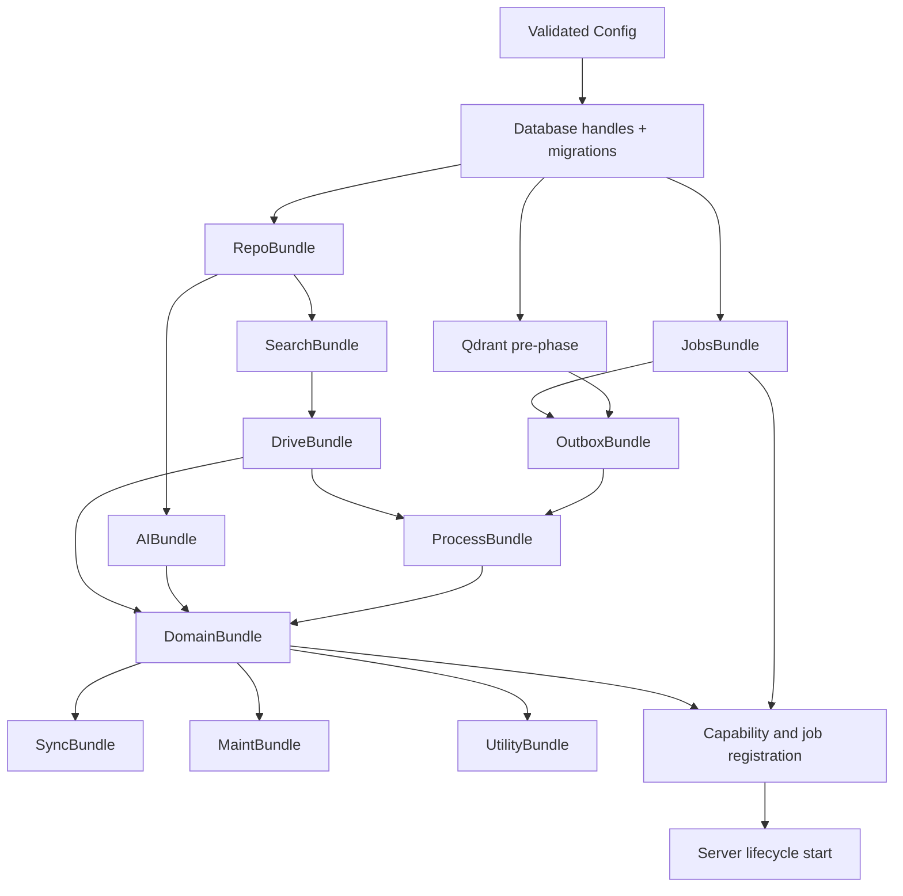
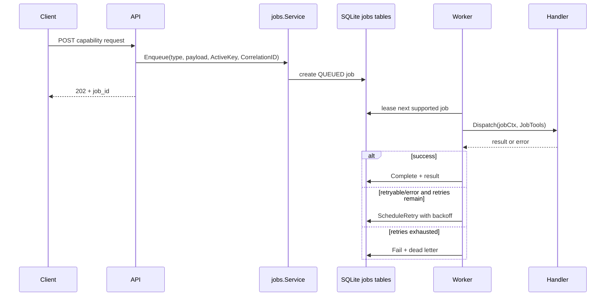
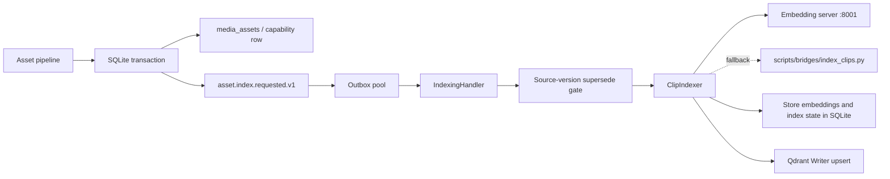
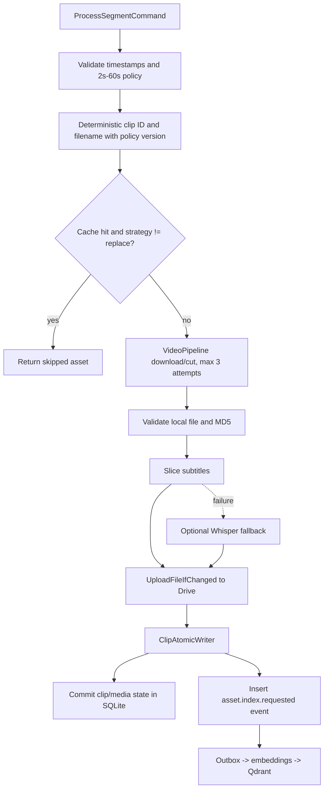
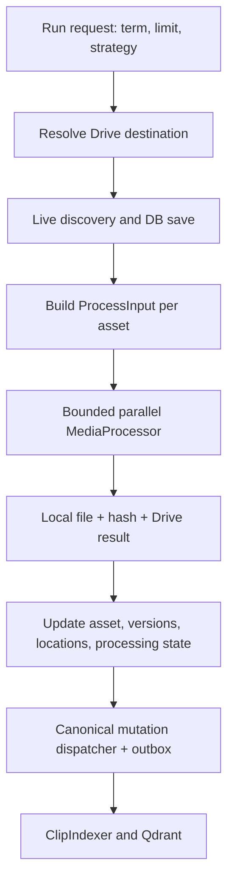

# PipelineGen — Current Architecture

> **Canonical scope.** This document describes the architecture that is running
> today: process boundaries, composition, data ownership, background execution,
> external adapters, and the main end-to-end flows.
>
> Read [`CANONICAL.md`](./CANONICAL.md) first when two documents disagree.
> Active migration state belongs to
> [`architecture/current.yaml`](architecture/current.yaml), package ownership to
> [`architecture/ownership.generated.yaml`](architecture/ownership.generated.yaml),
> and the live HTTP surface to
> [`docs/api/ACTIVE_API_GENERATED.md`](docs/api/ACTIVE_API_GENERATED.md).
>
> **Last reviewed against `main`: 2026-07-01.** This is a current-state document,
> not a target-tree proposal and not a migration diary.

## 1. System mental model

PipelineGen is a Go backend for discovering, downloading, transforming,
enriching, indexing, and delivering media. It combines synchronous HTTP
transport with durable asynchronous work.

The shortest correct mental model is:

| Concern | Canonical owner |
|---|---|
| Business records, job state, metadata, embeddings cache | SQLite |
| Search acceleration and vector similarity | Qdrant projection |
| Remote media delivery | Google Drive |
| Local working files and cache | `cfg.Storage.DataDir` |
| Long-running execution | SQLite-backed job broker and workers |
| Durable post-commit side effects | Transactional outbox |
| Business orchestration | `internal/application/**` |
| Concrete DB, Drive, Qdrant, yt-dlp, FFmpeg, Python and HTTP adapters | `internal/infrastructure/**` |
| Dependency construction and startup order | `internal/app/**` |

**SQLite is the source of truth.** Qdrant is a rebuildable index. Google Drive is
a remote file location, not the authoritative owner of application state.

## 2. Runtime entry points and modes

| Binary | Source | Responsibility |
|---|---|---|
| `pipelinegen` | `cmd/server/main.go` | Builds the full application, serves Gin HTTP, and starts the selected background runtime. |
| `pipelinegen-worker` | `cmd/worker/main.go` | Runs a worker process against the shared job broker. |
| `admin` | `cmd/admin/main.go` | One-shot migrations, reconciliation, diagnostics, backfills, API docs, and operational commands. |

The server validates configuration before composition and supports these modes:

| Mode | HTTP | Job runner | Schedulers | Maintenance |
|---|---:|---:|---:|---:|
| `all` | yes | yes | yes | yes |
| `server` | yes | no | no | no |
| `worker` | yes | yes | no | no |
| `scheduler` | yes | no | yes | yes |
| `maintenance` | yes | no | no | yes |

`cmd/**` is intentionally thin. It owns flags, signal handling, config loading,
logging startup, and the call into `internal/app`. Feature services, SQL,
provider selection, and route construction do not belong in entry points.

## 3. Architecture zones

```text
cmd/
  thin process entry points
        |
        v
internal/api/
  HTTP transport, binding, auth, response mapping
        |
        v
internal/application/
  use cases, orchestration, policies, ports, jobs, outbox handlers
        |
        v
internal/domain/
  shared stable contracts and domain types
        |
        v
internal/infrastructure/
  SQLite, Drive, Qdrant, Ollama, yt-dlp, FFmpeg, Python, HTTP adapters

internal/app/
  sits beside the chain as the only composition root and may import every zone

pkg/
  leaf utilities only; it must not import internal packages
```

| Zone | Owns | Must not own |
|---|---|---|
| `cmd/` | Process startup and shutdown | Repositories, routes, business rules |
| `internal/api/` | HTTP DTOs, validation at the transport boundary, status codes | SQL, Drive SDK calls, FFmpeg, provider orchestration |
| `internal/app/` | Construction order, adapters, bundles, route and job registration, lifecycle | Feature policy and business decisions |
| `internal/application/` | Use cases, typed ports, retries at workflow boundaries, job handlers | Raw external SDK details |
| `internal/domain/` | Shared entities and contracts used by multiple capabilities | Gin, SQL, config, loggers, external clients |
| `internal/infrastructure/` | Concrete technical adapters | Cross-capability business policy |
| `pkg/` | Small reusable leaf utilities | Imports from `internal/` |

The target-tree migration is tracked separately in
`architecture/policy.yaml`. Until a migration lands, the paths above describe
the real repository.

## 4. Composition root and startup order

`internal/app.NewComposition` builds a typed `ComposeRoot`. Construction is a
strict dependency graph; runtime goroutines start later through lifecycle
steps.



The current root contains eleven typed bundles plus the primary DB handle:

| Bundle | Main responsibility |
|---|---|
| `DriveBundle` | Drive `Admin`, `Reader`, `Publisher`, file lifecycle, destination resolver, media store |
| `RepoBundle` | SQLite repositories shared by capabilities |
| `SearchBundle` | Asset index, asset tree, provider registry |
| `ProcessBundle` | Media processor, clip indexer, VLM, Qdrant runtime-derived services |
| `AIBundle` | Ollama client, script generator, memory, script engine |
| `DomainBundle` | YouTube, voiceover, images, ingest, books, lessons, autotag, artifact service |
| `JobsBundle` | Job repository, service/facade, dispatcher, registry |
| `OutboxBundle` | Dispatcher, event repository, handler registry, event pool |
| `SyncBundle` | Catalog-to-Drive synchronization |
| `MaintBundle` | Maintenance and deletion services |
| `UtilityBundle` | Health, readiness, utility HTTP services |

Important construction rule:

```text
Qdrant pre-phase -> Outbox -> Process -> Domain
```

This breaks the former Qdrant/outbox/process dependency ring and guarantees
that producers receive the same outbox dispatcher and Qdrant runtime.

After composition, `WireRegistry` registers capability descriptors, routes,
job handlers, middleware, and startup steps. The job dispatcher is frozen after
registration so runtime code cannot add handlers dynamically.

## 5. Shared execution model: HTTP, jobs, and workers

Short operations may execute in the HTTP request context. Network-heavy,
CPU-heavy, and multi-stage operations should enqueue a job and return `202`.



The job system owns:

- job-type registration and policy in `internal/application/jobs/registry.go`;
- timeout, default retries, queue label, and declared concurrency;
- `ActiveKey` deduplication for non-terminal work;
- correlation IDs across API, parent jobs, child jobs, and logs;
- leases and lease renewal;
- cancellation polling;
- exponential idle polling backoff and wake-on-enqueue;
- progress/events and dead-letter storage;
- final-state writes on a bounded context that survives job-context
  cancellation.

The declared per-type `Concurrency` is policy metadata and a clamp for current
wiring; actual in-process parallelism still depends on the worker pool and on
capability-specific semaphores.

Jobs normally live in the primary DB. The optional
`jobs.split_db_enabled=true` EXPAND path opens `jobs.db.sqlite`, runs the
job-only migration ledger, and routes the broker there. The default remains
off.

## 6. Persistence, files, Drive, and the outbox

### SQLite databases

| Store | Default path | Purpose |
|---|---|---|
| Primary | `<DataDir>/media/media.db.sqlite` | Assets, scripts, voiceovers, channels, caches, jobs by default, outbox, lifecycle records |
| Jobs split, optional | `<DataDir>/media/jobs.db.sqlite` | Jobs, events, and dead letters when the EXPAND flag is enabled |
| Observability | `<DataDir>/observability/api_requests.db.sqlite` | HTTP request telemetry and retention rotation |

DB handles are opened by `internal/infrastructure/database/**`; migrations run
at boot. Normal runtime code should use repositories or narrow ports rather
than open databases itself.


### Semantic location DTO (canonical AssetLocationInput)

Every media-publishing path route semantically via the canonical `AssetLocationInput`
DTO declared at `internal/domain/delivery/location.go` (godlike/06 SSOT — single
canonical owner). Companion `internal/application/assets/delivery/BuildPublishRequest`
maps the typed shape into per-destination `PublishRequest` fields (Category / Subject /
Name / Style / Provider / Project / Language). See `architecture/current.yaml#SEMANTIC-LOCATION-API-2026-07-06`
umbrella wave-tracker for shipped evidence per wave (W1..W6).### Local filesystem

The local filesystem is a staging and cache layer. Common areas under
`DataDir` include media, clips, Artlist, YouTube, images, voiceovers, workspace,
cache, export, temporary files, backups, and observability.

Files must be validated before persistence or upload: non-empty path, existing
file, non-zero size, safe basename, and content hash where the capability
requires identity.

### Google Drive

Drive is split into narrow surfaces:

- `drive.Admin`: administrative and raw upload operations;
- `drive.Reader`: metadata, list, existence, and download operations;
- `delivery.Publisher`: canonical write/publish channel used by new pipelines;
- `drive.FileLifecycle`: move, rename, trash, and cleanup operations;
- destination resolvers: translate logical groups and explicit folder requests
  into concrete folder IDs and paths.

Application code should not receive the raw Google SDK client.

**Drive canonical rule (Pattern 12):** every application-layer Drive write MUST
route through `delivery.Publisher.Publish`. Direct calls to `*drive.Uploader`,
`*drive.Admin`, or `RootFolderOverride` in `internal/application/**` or
`internal/api/**` are blocked by the `percheck_root_override_ban` archcheck
scanner (CI `--strict` gate via `make verify-main`). All legacy call sites
(clips, images, voiceover, scripts) have been migrated. See
[AGENTS.md Pattern 12](AGENTS.md#pattern-12--drive-as-central-capability-fase-ae-closure-july-2026).

### Transactional outbox

The outbox connects an atomic SQLite commit to side effects that may fail or
outlive the request:

```text
BEGIN TX
  write canonical asset/business row
  write projections/locations when required
  insert versioned outbox event
COMMIT

outbox pool
  claim event
  validate schema
  call handler
  complete / retry / supersede / dead-letter
```

Current event families include indexing, index deletion, metadata work, and
voiceover cleanup. Event payloads are versioned. Permanent schema errors are
terminal; transient adapter errors retry with backoff; stale source versions
can be marked superseded.

## 7. Qdrant, embeddings, and media search

Qdrant is optional and is constructed once per process through
`qdrant.NewRuntime`. Every Qdrant subsystem shares one client and one schema:

| Runtime component | Role |
|---|---|
| `Client` | Authenticated HTTP transport |
| `Schema` | Versioned collection and runtime alias definition |
| `Writer` | Deterministic point upsert and delete |
| `Searcher` | ANN/vector search |
| `Manager` | Collection creation, schema checks, alias switch |
| `Health` | Readiness probe |
| `Cleaner` | Removes obsolete locator payloads |
| `Mapper` / `SQLiteAssetStore` | Hydrates canonical asset data from SQLite |
| `SearchAdapter` | Application-facing vector-search port |

### Indexing flow



The clip indexer:

1. reads the current asset from SQLite;
2. skips metadata-only sidecars;
3. computes a content hash;
4. takes a fast path when embeddings, source version, and `INDEXED` state match;
5. otherwise generates embeddings through the embedding sidecar, falling back
   to the Python script;
6. stores embedding data and index-state metadata in SQLite;
7. upserts the deterministic point into Qdrant;
8. marks the asset indexed.

The current index state machine is:

```text
DISCOVERED -> INDEX_PENDING -> INDEXING -> INDEXED
                               |
                               +-> INDEX_FAILED

INDEXED -> DELETE_PENDING -> DELETED
```

The outbox consumer compares the event `source_version` with the current SQLite
version before embedding work. Older events are superseded rather than allowed
to overwrite a newer point.

### Search flow

Search consumers call application ports, not the Qdrant client directly.
Qdrant returns candidate IDs and scores; SQLite remains responsible for current
metadata, locations, and capability-specific filtering/hydration. The optional
CrossEncoder reranker can reorder top candidates after vector retrieval.

When Qdrant is disabled, the runtime does not construct Qdrant components.
Capabilities must either use their documented SQLite/provider fallback or
report the feature unavailable; they must not invent vector results.

## 8. YouTube zone: discovery, download, extraction, and indexing

YouTube has two main entry paths:

1. explicit API/job requests for a known video and segment list;
2. the background channel monitor, which discovers videos and enqueues durable
   work.

### Per-segment canonical flow

`ProcessYouTubeSegmentUseCase` is the canonical segment pipeline:



The use case owns deterministic identity, duration policy, cache strategy,
retry classification, artifact validation, and the canonical `ClipAsset`
passed to the writer.

### yt-dlp and FFmpeg pipeline

The concrete video pipeline:

1. creates the output directory;
2. checks for a usable cached final clip unless strategy is `replace`;
3. fetches metadata through yt-dlp;
4. either:
   - cuts from `PreDownloadedPath` with FFmpeg copy mode, or
   - asks yt-dlp to download only the requested section;
5. normalizes with the shared FFmpeg processor using configured width, height,
   FPS, codec, preset, CRF, and audio policy;
6. optionally applies `config/watermark.png`;
7. deletes the temporary raw segment;
8. returns the final local path and downloader metadata.

The "download once, cut N times" optimization is represented by
`PreDownloadedPath`: one source file can feed many local FFmpeg cuts without
re-downloading each segment.

### Persistence and indexing

The canonical `ClipAtomicWriter` commits the clip projection and its indexing
event together. It, not the caller, owns the versioned outbox envelope. This
prevents a clip row from being committed without a durable indexing request.

### Channel monitor

When enabled, the monitor:

1. loads enabled channel configuration;
2. validates keyword and semantic-keyword JSON before any yt-dlp call;
3. lists new channel videos;
4. reserves discoveries in the durable discovery ledger;
5. obtains subtitles or transcript material;
6. classifies candidates with deterministic/semantic analysis;
7. enqueues channel-sync or extraction work;
8. records checked, rejected, enqueued, and failed outcomes with backoff.

Channel sync is intentionally serialized by job policy to protect discovery
deduplication while the parallel reservation path is hardened.

## 9. Artlist and provider ingestion zone

Artlist is a facade over specialized search, destination, run, diagnostics,
and job components.



Search providers form an injected fallback surface:

- persistent browser scraper for Artlist;
- optional Pixabay search;
- optional Pexels search.

The Node scraper is normally exposed on port `9123`. Search results are cached
in memory and SQLite to avoid repeating expensive browser work.

For each run, the orchestrator resolves a term folder, discovers candidates,
builds deterministic local output directories, and processes clips with
bounded concurrency. The media processor owns download/transform/publish
details. Persistence then updates the canonical asset and dispatches the
versioned indexing event. The old fire-and-forget indexing stage is a no-op.

All Drive writes in the modern Artlist path go through
`delivery.Publisher`; missing publisher or outbox wiring is a composition-time
failure.

## 10. Assets, scripts, voiceover, images, and content

### Unified asset model

`media_assets` is the cross-capability searchable projection. Capability
tables may retain richer domain records, while shared asset concerns use:

- stable asset ID and source;
- media type and lifecycle state;
- local and Drive locations;
- file/content hashes;
- versions and processing steps;
- metadata/search text;
- embedding and index-state fields.

New ingestion paths should use a shared registry, resolver, writer, or sampler
instead of duplicating source switches and persistence logic.

### Script generation

The canonical script route is async. For `generate-from-clips`:

1. the HTTP handler maps the request into the canonical generation envelope;
2. the source resolver hydrates clip evidence from SQLite, including Drive
   links and descriptions;
3. the script engine calls Ollama with topic, tone, guidelines, language, and
   evidence;
4. scenes are associated with real clips;
5. optional post-processing can generate metadata, images, entities, and
   voiceover;
6. the document processor can write a Google Doc containing narrative text and
   structured `SpecScene` JSON;
7. job result and optional DB records expose the generated artifacts.

Qdrant may help candidate search, but the final clip evidence and Drive
locations are hydrated from SQLite.

### Voiceover

The public route enqueues `voiceover.generate`. The modern path fans out one
`voiceover.generate_item` child per item:

```text
API -> parent job -> child jobs
    -> destination resolution
    -> Edge TTS Python bridge
    -> optional FFmpeg silence removal
    -> Drive publish
    -> SQLite finalization + outbox
    -> parent aggregation
```

The Python bridge is `scripts/bridges/tts_edge.py`; it accepts a per-item voice
override and otherwise resolves a language default. Go validates that the
output file exists and is non-empty, computes a hash, and records the actual
voice returned by the bridge.

The repository still contains legacy `Service.GenerateBatch` consumers.
Therefore voiceover is a transition boundary: new work must converge on one
destination resolver, one post-processing owner, and one atomic finalizer
rather than add another pipeline variant.

### Images and fullimages

The image capability coordinates prompt generation, the canonical AI
provider (Google Slides via Chrome/Playwright, single model `nano-banana-pro`),
local image storage, metadata, Drive publication, and asset persistence.
The selectable `model` JSON field was retired from image DTOs/ports/jobs in
July 2026 (surface 1 cut); callers cannot switch the generation backend or
model — the canonical provider is enforced globally through
`internal/application/images/generated/provider_registry.go` and the
`generated.CanonicalGoogleSlidesModel` typed constant. Field-level model
selection on `/api/images/**` is gone; legacy `model` JSON keys are silently
ignored (forward-pointer to godlike/07 fail-closed rejection in a future
commit).
`/api/images/**` handles image generation and catalog operations.
`/api/fullimages/**` is a separate video-producing surface that combines the
image service, FFmpeg, and the Drive media store.

Generated assets should enter the same asset/outbox/indexing model as imported
media instead of being written directly to Qdrant.

### Books and lessons

Books and lessons are application services backed by Ollama/script generation,
image generation, document creation, and Drive delivery. They reuse shared
capabilities; they do not own alternative DB, Drive, or LLM clients.

## 11. External systems and technical adapters

| Dependency | Typical endpoint/tool | Used for |
|---|---|---|
| Google Drive | OAuth2 API | Remote folders, publication, downloads, docs, cleanup |
| Qdrant | `:6333` / `:6334` | Versioned vector index and ANN search |
| Ollama | `:11434` | Script generation, translation, metadata and analysis |
| Clip embedding server | `:8001` by default | Text/transcript/media embedding generation |
| CrossEncoder | `:8091` by default | Optional candidate reranking |
| Node Artlist scraper | `:9123` | Persistent browser-backed discovery |
| NVIDIA/VLM services | configured HTTP endpoints | Image/VLM generation and enrichment |
| `yt-dlp` | subprocess | YouTube metadata, listing, subtitles, section download |
| FFmpeg | subprocess | Cut, normalize, transcode, watermark, audio cleanup |
| Python bridges | `scripts/bridges/**` | TTS, embedding, books, and specialized processing |

External processes are never business-layer dependencies directly. They are
wrapped by infrastructure adapters and injected behind application ports.

Some sidecars may be started or watched by PipelineGen when configured, such
as the clip embedding server. Others are expected to be managed externally
through systemd, containers, or operator tooling.

## 12. Lifecycle, health, observability, and maintenance

Composition does not start background goroutines. Startup steps are assembled
and then executed by the server lifecycle in order. The required job runner is
started after optional scanners, monitors, sweepers, and metrics services so
handlers and dependencies are ready before jobs can be claimed.

Background services include, depending on mode and configuration:

- job scanner and lease recovery;
- job metrics refresher;
- outbox event pool;
- voiceover parent aggregator;
- channel monitor;
- retention and maintenance sweepers;
- cache and metadata cleanup;
- embedding server watchdog;
- job runner.

Shutdown cancels the root context, stops explicit services in reverse order,
and closes DB/Drive resources owned by the root.

Health is layered:

- `/health`: process/component health;
- `/ready`: readiness barriers for dependencies required to serve work;
- `/metrics`: Prometheus metrics;
- job events and progress: durable operational audit;
- structured Zap logs with correlation IDs;
- observability SQLite DB for HTTP request telemetry.

The observability DB is disposable operational data. Rotation/offload is owned
by the admin command and retention configuration; it is not the domain source
of truth.

## 13. Ownership, extension rules, and known transition boundaries

### Where a change belongs
| New source/provider package | `internal/application/assets/providers/<source>/` (sub-packages: drive, http, catalog, artlist, youtube, stock) | Provider registry + per-source adapters. **Hierarchy note:** 1st-class transport-side providers are `drive` + `http` + `catalog` (persistence + retrieval primitives). Source-side adapters (`artlist`, `youtube`, `stock`) are sub-facades that build on the transport providers — add new source-side logic there to avoid sourcing-switch sprawl in `internal/sources/`. |
| Clipsadapter sub-package | `internal/application/assets/clipsadapter/` **(NOT IMPLEMENTED — see docs/migrations/phase2-residual.md "## PR-c-1 (sub-package extraction)" section under LEGACY VERIFICATION NARRATIVE)** | Transitional adapter-glue and boundary-type facade for ClipsRegistry + Voiceover/Image converters. Directory does NOT exist as of main HEAD `ba4f664d`; multiple PR-c-1 tornatas reverted due to bare-reference propagation + global goimports over-spreading qualifier-prefixes. Will revisit per docs/migrations/phase2-residual.md "safe-path lesson" (manual per-file import management, NOT global goimports). |
| Sub-package inventory location | `ARCHITECTURE.md §14` | The discovery inventory of composition bundles + provider sub-packages + transitional clipsadapter. Always cross-reference §14 from §13 for the canonical landscape. |


| Change | Canonical location |
|---|---|
| New HTTP endpoint | `internal/api/<capability>/`, delegating immediately to an application use case |
| New use case or workflow | `internal/application/<capability>/` |
| New external integration | Port near the consumer plus adapter under `internal/infrastructure/<integration>/` |
| New job type | `internal/application/jobs/registry.go` plus one registered handler |
| New durable side effect | Versioned outbox producer and registered outbox handler |
| New table/column | `migrations/sqlite/**` plus the owning repository |
| New Drive write | `delivery.Publisher` or the appropriate Drive port |
| New vector operation | Qdrant application port backed by the single `QdrantRuntime` |
| New source/provider | Shared source catalog/registry; do not spread source switches |
| New CLI operation | `cmd/admin/**`, delegating to reusable services |

### Current transition boundaries

- **Target tree:** `internal/application`, `internal/domain`, and
  `internal/infrastructure` are still the real current zones; migration toward
  `internal/capabilities`, `internal/kernel`, and `internal/platform` is
  tracked but incomplete.
- **Jobs DB split:** EXPAND wiring exists, default is still the primary DB.
- **Voiceover:** modern parent-child execution and legacy batch consumers
  coexist.
- **Qdrant:** optional and rebuildable; SQLite remains authoritative.
- **YouTube optional ports:** subtitle, Whisper, and some enrichment stages may
  be nil/config-gated; required cut/hash/writer ports fail at composition.
- **Capability descriptors:** route ownership is converging on
  `Build(Dependencies) -> api.Descriptor`; consult the inventory and route
  manifest before adding direct registration.

### Non-negotiable invariants

1. One owner per fact.
2. No direct DB/Drive/Qdrant/FFmpeg work in HTTP handlers.
3. No new fire-and-forget side effect when an outbox event can make it durable.
4. No second client/runtime for the same external system inside one process.
5. No success state before required artifacts and canonical persistence finish.
6. No duplicated source switches; use a shared registry/resolver.
7. No mutable global runtime configuration.
8. Every long-running path must propagate context and classify retries.
9. Qdrant points are projections and may be rebuilt from SQLite.
10. Architecture changes update this document in the same commit.

## 14. Sub-package inventory

> **Discovery pointer.** This section provides navigation anchors for architectural sub-zones. Per the AGENTS.md "One owner per fact" invariant, the canonical inventory lives in §4 (composition bundles) + §13 (provider/clipsadapter ownership); §14 below is a pointer-only mirror to make sub-zones self-discoverable. Do not duplicate enumerated lists here — that would erode the SSOT invariant.

### 14.1 Composition bundles

Path convention: `internal/app/build_bundles_<name>.go`. **Canonical reference:** see [§4 Composition root and startup order](#4-composition-root-and-startup-order) for the authoritative inventory of the 11 composition bundles (DriveBundle / RepoBundle / SearchBundle / ProcessBundle / AIBundle / DomainBundle / JobsBundle / OutboxBundle / SyncBundle / MaintBundle / UtilityBundle).

### 14.2 Provider sub-packages

Path convention: `internal/application/assets/providers/<source>/`. **Canonical reference:** see the Provider row in [§13 Where a change belongs](#where-a-change-belongs) for the authoritative hierarchy rules (1st-class transport providers `drive` + `http` + `catalog`; source-side adapters `artlist` + `youtube` + `stock` building on top of transport providers — add new source-side logic inside the `providers/` registry to avoid sourcing-switch sprawl in `internal/sources/`).

### 14.3 Transitional clipsadapter sub-package (NOT IMPLEMENTED)

Path convention: `internal/application/assets/clipsadapter/`. **Canonical reference:** see the Clipsadapter row in [§13 Where a change belongs](#where-a-change-belongs) and [`docs/migrations/phase2-residual.md` "## PR-c-1 (sub-package extraction)"](./docs/migrations/phase2-residual.md) for the active status and legacy extraction narrative. Directory does NOT exist on main; multiple tornatas reverted due to bare-reference propagation + global goimports over-spreading qualifier-prefixes. Revisit per the safe-path lesson (manual per-file import management, NOT global goimports).

## 15. Verification and authoritative references

```bash
# Full repository verification
make verify-main

# Architecture and ownership
bash scripts/ci-architectural-checks.sh
go run ./cmd/archcheck
go run ./cmd/architecture-aggregate

# Build and tests
go build ./...
go vet ./...
go test ./...

# Generate route documentation
go run ./cmd/admin gen-api-docs

# Run server
go run ./cmd/server --mode all --config config.yaml
```

Authoritative references:

- [`CANONICAL.md`](CANONICAL.md): which document wins;
- [`architecture/current.yaml`](architecture/current.yaml): active migration
  waves and exit gates;
- [`architecture/policy.yaml`](architecture/policy.yaml): target-tree and size
  policy;
- [`architecture/ownership.generated.yaml`](architecture/ownership.generated.yaml):
  package and capability ownership;
- [`architecture/routes.yaml`](architecture/routes.yaml): route manifest;
- [`docs/api/ACTIVE_API_GENERATED.md`](docs/api/ACTIVE_API_GENERATED.md):
  generated live HTTP surface;
- [`AGENTS.md`](AGENTS.md): engineering invariants and workflow rules;
- [`internal/domain/delivery/location.go`](internal/domain/delivery/location.go): canonical SOLE owner of the `AssetLocationInput` semantic-location DTO (SEMANTIC-LOCATION-API-2026-07-06 Wave 1 ship_sha 7b5ff5ef + umbrella Wave 7 ship_date 2026-07-06).
- [`architecture/decisions/`](architecture/decisions/): accepted architectural
  decisions.

When code and this document diverge, fix the code or update this document
immediately. Do not preserve a known contradiction as historical narrative;
history belongs under `docs/archive/` or `architecture/archive/`.

---

## Recent closures (July 2026, audit-pin)

The following recent closures are documented in detail in the corresponding `AGENTS.md` "Known Issues & Fixes" entries + `CHANGELOG.md` closures + `architecture/deprecations.yaml` canonical records. This section is the single-page navigation pointer; the granular per-commit / per-PR decomposition lives in the canonical sources above.

| Tag | SHA | Surface | Anchor |
|-----|-----|---------|--------|
| P1.4 | `442a4dfe` | Prometheus metrics for `StartupDriveRootsValidator` (4 metrics + typed-NIL optional 4th ctor arg) | AGENTS.md entry #18 + CHANGELOG `## Unreleased -> ### Added -> P1.4` + `regression-fixup 9856a2b6` (DeliveryStatus rename) |
| P1.5 | `819c9d95` | Typed Google API errors + RFC 7231 §7.1.3 Retry-After + jitter extension (6 SDK exits) | AGENTS.md entry #17 + CHANGELOG `## Unreleased -> ### Added -> P1.5` |
| P2.1 | `96ec87e1` | Eliminate package-level mutable test seams in `internal/infrastructure/drive/` (lookupFunc + openFile → `*Uploader` struct fields) | AGENTS.md entry #16 + CHANGELOG `## Unreleased -> ### Refactor -> P2.1` |
| P2.2 | `0fa8c065` | DRIVE-008 fail-closed stubs for `ClipDriveUploaderPort.UploadFile*` + `sourcing.DrivePort.UploadFileWithDescription` (canonical replacement: `delivery.Publisher.Publish`) | AGENTS.md entry #15 + CHANGELOG `## Unreleased -> ### Refactor -> P2.2` + `architecture/deprecations.yaml#DRIVE-008` + `architecture/current.yaml#PR-DRIVE-008-CUTOVER` |

godlike/07 honest-limitation: the surfaced TODOs `TODO(Fase 3.3)` (in `internal/infrastructure/drive/store.go:173`) and `TODO(Fase 3.5)` (in `internal/app/adapters_voiceover_use_case.go:203`) are LEGITIMATE open work (Fase 3 Spina Dorsale `DRIVE-STORE-UPLOAD-TO-DRIVE` migration is still in `migration_phase: EXPAND / status: in_progress`); they remain in place until the canonical image-upload migration closes. The 0-closed TODO audit (rg `TODO\(Fase [0-9]+\.[0-9]+\)` returns 2 hits, both active) means P2.4 has no stale-closure work to chase.

---

## 16. Artlist integration

> **Authoritative doc pointer** (per CANONICAL.md §1): this section is the canonical architectural surface for the Artlist integration. Forward-pointers: `AGENTS.md` rules `DL-006` (composition-root fail-closed gate) + `DL-007` (Pattern 0 port routing) + `docs/operations/artlist-runbook.md` (operator-facing SRE runbook) + `architecture/current.yaml#ART-002` (wave-tracker entry).

### 16.1 Architecture zones

The Artlist integration spans 3 application-zone files + 2 infrastructure files + 1 composition-root entry. The decomposition mirrors `godlike/06 SSOT` (one canonical owner per fact) + `AGENTS.md Pattern 5` (capability-stable directory split, NOT file-flattening):

| File | Zone | Role |
|------|------|------|
| `internal/application/assets/providers/artlist/` | application | Canonical Artlist service + ports + use cases + semantic enricher + search cache |
| `internal/infrastructure/artlist/scraper/scraper.go` | infrastructure | Persistent Node scraper server client (httptest.NewServer emulation contract) + exec fallback |
| `internal/infrastructure/artlist/downloader/downloader.go` | infrastructure | Go-primary downloader (HLS via yt-dlp, progressive via http.Get) |
| `internal/infrastructure/artlist/health/probe.go` | infrastructure | 60s-tick health probe + 3-consecutive-failures alert (P1.3 SRE surface) |
| `internal/app/build_bundles_artlist.go` | composition root | `WireArtlist` (4 mandatory fail-closed gates) + `registerArtlist` lifecycle step |

### 16.2 Canonical ports (Pattern 0)

Per `AGENTS.md Pattern 0` + `DRIVE-005` precedent (Wave 27, June 2026), all external I/O in `internal/application/assets/providers/artlist/**` routes through canonical typed ports declared in the application package, with concrete adapters in `internal/infrastructure/`:

| Port (canonical) | Adapter (concrete) | Responsibility |
|------------------|--------------------|----------------|
| `artlist.AssetStore` | `*assets.ClipsRepository` | 7-method CRUD on `media_assets` (PR2.5 promoted) |
| `artlist.Indexer` | `*clipindexer.Service` | `IndexClip` (write to `media_assets`) + `IsEnabled` |
| `artlist.Dispatcher` | `*outbox.Dispatcher` | `EnqueueAndIndex` + `SaveDiscoveredAsset` (idempotent outbox + media_assets write) |
| `artlist.Publisher` | `*delivery.Publisher` (DRIVE-005) | Conflict-aware uploads + `ConflictPolicy` + `PutFileRequest`/`PutAction` |
| `artlist.Reader` | `*drive.Reader` (DRIVE-005) | Download + metadata + listing + existence |
| `artlist.FileLifecycle` | `*drive.FileLifecycle` (DRIVE-005) | Trash + Move + Rename + Cleanup |
| `artlist.DocClient` | `*drive.DocClient` (DRIVE-005) | Google Docs creation |
| `artlist.Searcher` | `*scraper.Provider` | Live search via persistent Node scraper server (httptest emulation) |

**Compile-time pin discipline** (per `AGENTS.md Pattern 0`): each concrete adapter carries `var _ <port> = (*<concrete>)(nil)` at struct declaration site. Future port signature drift surfaces as a build failure, not a runtime panic.

### 16.3 Two download surfaces (godlike/06 SSOT audit-pin)

The Artlist download path has TWO surfaces (per `P0.2` audit-pin, July 2026):

1. **Go-primary** — `internal/infrastructure/artlist/downloader/downloader.go::Provider.Download(ctx, url, LocalPath)` via yt-dlp (HLS detection on URL) or `http.Get` (progressive MP4). Wired by composition root via `downloader.New(cfg, downloader.Config{})` + `NewArtlistStager` at `internal/app/build_bundles_artlist.go::WireArtlist`. Orchestrator at `run_orchestrator_stages.go::stageProcessBatch` always tries `StageSource` first; on graceful-degrade the mediaProcessor takes over.

2. **Node-fallback** — `internal/infrastructure/media/processor/processor_download.go::downloadViaScraper`, invoked by `mediaProcessor.Process` ONLY when `input.LocalPath == ""` AND the URL is Artlist-shaped (per `isArtlistURL` gate in `processor.go`).

**Divider rule** (per `godlike/07 minimum-blast-radius`): Go-primary is the canonical path; Node-fallback is the per-invocation sequential gate for cold-start / server-down scenarios. NO `sync.Mutex` involved. `mediaProcessor.Process` at `processor.go:146` short-circuits the `downloadStep` call when `input.LocalPath != ""` (per the `// Step 9/12 wire-up (July 2026): when input.LocalPath != "", the download step is bypassed` godoc comment, grep-verifiable). The `Process` post-download conditional re-uses the same `input.LocalPath` flag, so the 2 surfaces are mutually-exclusive per call.

**godlike/06 forward-pointer** (`PR-ARTLIST-DOWNLOAD-SURFACE-UNIFY`, deadline 2026-08-15): collapse the duplicated HLS detection (`isHLS` in downloader.go vs `isHLSURL` in processor) + dual-auth strategy (cookies file in Go vs browser session in Node) into ONE canonical surface. Until then, the dual-surface architecture is the SSOT audit-pin.

### 16.4 Node scraper server contract (httptest emulation)

The persistent Node scraper (`node-scraper/artlist_server.js`) exposes 2 endpoints:

- `POST /search` — search request (`{term, limit}` JSON body) returns `{ok, term, clips[], search_url, saved}` JSON envelope. **5xx** or network error → `artapp.ErrTransportFallback` → exec fallback (per `scraper.go:108-117`); **4xx** (non-200) → `artapp.ErrInvalidResponse` (NO fallback per `scraper.go:114` — the `// do NOT fall back to exec on 4xx` comment is the explicit contract).
- `POST /download` — download request (`{clip_id, destination}` JSON body) returns the binary asset.

The Go client (`scraper.Provider`) is a thin httptest.NewServer-compatible HTTP client: any test that emulates the Node contract via `httptest.NewServer` exercises the production path end-to-end (per `tests/e2e/artlist_live_search_test.go` P2.1 E2E test). The `Response` struct in `scraper.go:36-50` is the canonical mirror of the Node JSON shape; the application never sees this raw shape (the `toCandidates` adapter translates to `artapp.Candidate`).

**Tight timeouts** (P2.3 E2E test discipline): 1s HTTP timeout + 2s exec timeout + 5s ctx timeout — the test fails fast in CI deadlock scenarios. Production wire-up honors `cfg.External.ArtlistHTTPTimeout` (default 2 min) + `cfg.External.ArtlistExecTimeout` (default 4 min).

### 16.5 Prometheus metrics (7 series max)

Per P1.1 + P1.3 SRE surfaces (declared in `internal/infrastructure/observability/metrics_artlist.go`):

| Metric | Type | Labels | Series | Semantic |
|--------|------|--------|--------|----------|
| `artlist_download_path_total` | Counter | `path` (`browser` \| `yt-dlp` \| `http` \| `hls`) | 4 max | Per-attempt (NOT per-completion) |
| `artlist_scraper_probe_total` | Counter | `result` (`success` \| `failure`) | 2 max | Per-tick (60s cadence) |
| `artlist_scraper_health_alerts_total` | Counter | (none) | 1 | Alert-once-per-3-failure-streak |

**Per-attempt-not-per-completion discipline** (P1.1 `Help` text): a single `Download` that retries 3 times on a flaky HLS CDN adds 3 to the `artlist_download_path_total{path="yt-dlp"}` counter. `rate()` over this metric is the ATTEMPT rate, NOT the success rate. Dashboards MUST treat `rate()` as attempt pressure, not completion volume. To compute the success rate, cross-reference with the `job.StatusSUCCEEDED` counter via the Qdrant-001 reconciliation log.

**3-failure alert semantic** (P1.3): the probe fires `artlist_scraper_health_alerts_total` once per 3-failure streak (3 failures = 1 alert, 6 failures = 2 alerts, streak resets to 0 after each alert). Operators should monitor the alert counter for "Node scraper down for 3+ minutes" signals.

**Reserved path labels** (forward-compat with `PR-ARTLIST-DOWNLOAD-SURFACE-UNIFY`): `browser` and `hls` are not fired today; `yt-dlp` and `http` cover the current Go-primary path. The 4 consts are mandatory at every call site — mis-spelled values create new time-series silently (textbook Prometheus footgun).

### 16.6 Composition-root integration (WireArtlist)

The composition root at `internal/app/build_bundles_artlist.go::WireArtlist` is the canonical wiring site. The 4 mandatory fail-closed gates (P0.1 godlike/07 fail-fast-at-boot > fail-slow-at-first-/run):

1. **Publisher gate** — `cfg.Drive.Publisher != nil` (DRIVE-005 surface; canonical upload port)
2. **Dispatcher gate** — `*outbox.Dispatcher != nil` (idempotency contract; canonical async surface)
3. **ClipsRepo gate** — `*assets.ClipsRepository != nil` (canonical 7-method CRUD)
4. **Jobs.Service gate** — `*appjobs.Service != nil` (canonical job broker spine)

Plus the P0.1 boot-time gate `validateArtlistScraperURL(cfg *config.Config) error`:

- If `cfg.Features.ArtlistEnabled=true` but `cfg.External.ArtlistScraperServerURL=""` → abort loudly with an actionable error naming both escape hatches: set `ARTLIST_SCRAPER_SERVER_URL` to a real Node-scraper URL (e.g. `http://artlist-scraper:9123` from `docker-compose.yml`) OR disable the feature via `VELOX_FEATURE_ARTLIST_ENABLED=false` (default).
- If `ArtlistEnabled=false` → zero-state skip path (no-op).

The `registerArtlist` caller downgrades any `WireArtlist` error to `log.Warn + wiring.ArtlistSvc=nil + return nil` so composition boot NEVER aborts because Artlist is optional in the architecture. Read-only endpoints (`/stats`, `/diagnostics`, `/search/live`) unaffected by forward-pointer nil; write endpoints (`/run`, `/recommend`, `/sync-catalogs`) return 503 at runtime via the handler's nil-tolerance discipline once per-field wiring closes (forward-pointer entries `PR-ARTLIST-{STAGER,LIFECYCLE,REPOS,SYNCSERVICE}`).

### 16.7 Lifecycle integration (P1.3 health probe)

The `artlist-scraper-health-probe` StartupStep is registered in `internal/app/lifecycle_scheduler.go::buildSchedulerSteps` when BOTH `cfg.Features.ArtlistEnabled=true` AND `cfg.External.ArtlistScraperServerURL!=""`. The step is OMITTED (not `ErrCapabilityDisabled`) when Artlist is off — the capability is intentionally absent in that case, not "disabled at startup" (no fake-availability per godlike/07).

The probe's `Start` closure calls `ap.Start(startCtx)` (probe's own ticker goroutine, no `SafeGo` wrap needed; the probe is panic-safe via `defer recover()` per P1.3 code-reviewer fix). The `Stop` closure calls `ap.Stop(stopCtx)` with the parent lifecycle's stop context (5s wait cap per the probe's internal ctx). First probe fires IMMEDIATELY at boot (per P1.3 code-reviewer fix; without this, `time.NewTicker` waits one interval = 60s, breaking the godlike/07 fail-fast promise).

### 16.8 E2E test surface (P2.1 + P2.2 + P2.3)

3 E2E test scenarios live in `tests/e2e/` (new directory, new `e2e` package):

| Test file | Scenario | TDD scope |
|-----------|----------|-----------|
| `tests/e2e/artlist_live_search_test.go` | Node ON live search (4 subtests: happy + 3xx + ok=false + empty) | `scraper.Provider` response contract |
| `tests/e2e/artlist_full_run_test.go` | Full search → fetch → upload pipeline (3 staged assertions) | Pipeline wiring + mock Drive publisher |
| `tests/e2e/artlist_fallback_test.go` | 5xx → exec fallback (Case A: exec succeeds / Case B: exec returns env-dependent error) | `scraper.go:108-117` exec branch |

**godlike/07 honest-limitation**: the 3 tests are self-contained and exercise the REAL production `scraper.Provider` (no stub). External dependencies (Node, Drive, Artlist API) are mocked via `httptest.NewServer`. The `FullRun` test uses `http.Get` directly for the download stage (not the production `Downloader`) to avoid pulling in `*config.Config` wiring (which has pre-existing build issues per `architecture/current.yaml#PRE-EXISTING-BUILD-ISSUES-2026-07-04`); the production `Downloader` is exercised by the integration test suite.

### 16.9 Forward-pointers (PR-ARTLIST-* in flight)

The following P0/P1/P2 items have follow-up work documented as PR-ARTLIST-* linked_issues under `architecture/current.yaml#ART-002`:

- `PR-ARTLIST-DOWNLOAD-SURFACE-UNIFY` (deadline 2026-08-15) — collapse the 2 download surfaces to 1 canonical surface (P0.2 godlike/06 forward-pointer).
- `PR-ARTLIST-FAIL-CLOSED-SCRAPER-URL` (deadline 2026-07-25) — P0.1 gate already shipped; the linked_issue is a wave-tracker entry for audit-pinning the closure.
- `PR-ARTLIST-DOWNLOAD-PATH-METRIC` (deadline 2026-07-25) — P1.1 already shipped; the linked_issue is a wave-tracker entry for audit-pinning the closure.
- `PR-ARTLIST-SCRAPER-HEALTH-PROBE` (deadline 2026-07-25) — P1.3 already shipped; the linked_issue is a wave-tracker entry for audit-pinning the closure.
- `PR-ARTLIST-E2E-P2-{1,2,3}` (deadline 2026-07-25) — P2.1 + P2.2 + P2.3 E2E test scenarios (live search + full run + fallback); all 3 SHAs landed (6082f445 + a116881e + 7c3bd085).
- `PR-ARTLIST-STAGER` (deadline 2026-08-15) — `Stager` field wiring closure.
- `PR-ARTLIST-LIFECYCLE` (deadline 2026-08-15) — `LifecycleService` field wiring closure.
- `PR-ARTLIST-REPOS` (deadline 2026-08-15) — `AssetProcRepo` + `AssetVerRepo` + `AssetLocRepo` field wiring closure.
- `PR-ARTLIST-SYNCSERVICE` (deadline 2026-08-15) — `ClipResolver` field wiring closure in `Build(Dependencies)`.
- `PR-ARTLIST-SEARCHERS` (deadline 2026-07-25) — `PixabaySearcher` + `PexelsSearcher` field wiring closure.
- `PR-ARTLIST-CHIP2` (deadline 2026-08-15) — chip-2 forward-pointer (residual outbox/typed-port hardening).
- `PR-ARTLIST-STATS-MINIMAL-RESTORE` (deadline 2026-07-25) — minimal `GET /stats` route restoration post-FASE-6.

**Cross-references** (3 surfaces lockstep): this ARCHITECTURE.md section + `AGENTS.md` `## Recent cross-cutting closures (June 2026)` ART-002 mirror + `architecture/current.yaml#ART-002` wave-tracker entry.
