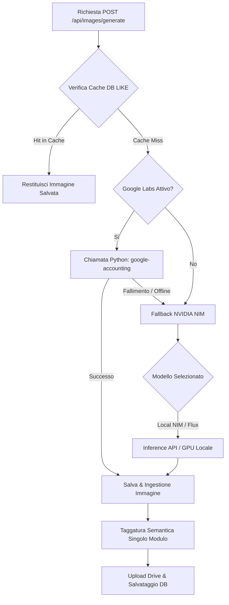

# Architettura e Flusso di Generazione Immagini AI

Questo documento descrive in dettaglio il funzionamento del servizio di generazione delle immagini all'interno del backend di **PipelineGen**, analizzando le strategie di fallback, il sistema di cache multilivello, la taggatura semantica e la gestione delle risorse di sistema.

---

## 🗺️ Panoramica dell'Architettura

La generazione delle immagini è coordinata dal pacchetto Go `images` situato in `docs/images/`. Il servizio implementa un flusso **"Smart Generation"** che unisce automazione RPA basata su browser (Google Labs) ed API di inferenza diretta (NVIDIA NIM / Flux).

---

## 🚀 Strategia di Generazione a Due Livelli

Il punto di ingresso primario per la generazione è la funzione [GenerateSmartImage](docs/images/google_generate.go#L27) che orchestra i due livelli:

### 1. Livello Primario: Google Labs Flow
* **Descrizione**: Interagisce con il server locale `google-accounting` (scritto in Python).
* **Funzionamento**: Avvia un'automazione basata su browser (tramite Deno/Dolly) che modella ed estrae immagini direttamente da Google Labs o Google Vids.
* **Integrazione**: Comunica in modo asincrono. Il server Go effettua un `POST /generate-vids-images` per avviare il job e interroga periodicamente `GET /status/{job_id}` fino al completamento della generazione.

### 2. Livello Secondario (Fallback): NVIDIA NIMs / Flux
* **Descrizione**: Se il flusso Google fallisce, è offline, o restituisce zero immagini, il sistema effettua automaticamente lo switch su NVIDIA NIMs.
* **Modelli supportati**: 
  * `flux-1-dev` (Black Forest Labs via Nvidia Cloud)
  * `flux.1-schnell`
  * `flux-2-klein`
  * `local-nim` (modello locale eseguito direttamente sulla GPU della macchina)
* **Ottimizzazione Dimensioni**: La risoluzione dell'immagine viene automaticamente validata e arrotondata a multipli di `64` (da `768x768` fino a `1344x1344`) come richiesto dai modelli Flux.

---

## 💾 Strategia della Cache (L1 / L2)

Per ottimizzare i tempi di risposta (portandoli da decine di secondi a **~1ms**) ed evitare inutili consumi di API esterne, il sistema adotta un meccanismo di cache a due livelli:

1. **Livello 1 (In-Memory)**: Utilizza strutture `sync.Map` per memorizzare in RAM le immagini richieste di recente.
2. **Livello 2 (SQLite)**: Le immagini e i loro metadati sono salvati nella tabella `media_assets` del database `media.db.sqlite`.
3. **Ottimizzazione SQL (LIKE Pattern)**: 
   * La cache è configurata per trovare corrispondenze usando un pattern flessibile `LIKE '%for prompt: <prompt>'`.
   * Questo consente di **riutilizzare le immagini** a prescindere dal motore che le ha generate originariamente (Google Vids o NVIDIA NIM), risolvendo un bug di cache-miss che ridondava le generazioni.

---

## 🏷️ Pipeline di Ingestione e Taggatura Semantica

Una volta generata o scaricata l'immagine, questa viene processata tramite la funzione [IngestImage](docs/images/ingest.go#L42):

* **Deduplicazione SHA-256**: Calcola l'hash univoco dell'immagine prima del salvataggio per evitare duplicati fisici sul disco.
* **Organizzazione su Disco**: I file vengono salvati in `/data/images/{style}/{subject}/`.
* **Pattern Single-Call Tagger**:
  * Viene invocato il modulo `semantic.Tagger()` **una sola volta** tramite il metodo helper `tagImageMetadata()`.
  * Il payload risultante (che estrae tag, soggetti, colori e azioni usando una tassonomia centralizzata) viene scritto nel file `metadata.json` caricato su Google Drive ed è riutilizzato contemporaneamente per popolare le colonne del record di database locale.

---

## ⚡ Parallelismo Google Vids (Giugno 2026)

Per la generazione di immagini in contesti multi-scena (es. `POST /api/script/generate-from-clips` con `num_clips > 0` o `clip_ids`),
il sistema adotta **4 ottimizzazioni** per ottenere parallelismo reale.

Vedi il documento dedicato: [docs/PARALLEL_IMAGE_GENERATION.md](./PARALLEL_IMAGE_GENERATION.md)

### Riepilogo

| Ottimizzazione | Descrizione | File |
|---------------|-------------|------|
| **Isolated mode** | Bypassa il project lock — ogni richiesta ha un progetto dedicato | `google_generate.go`, `session_pool.py` |
| **Per-slot projects** | Ogni slot del pool ha il suo progetto Vids | `session_pool.py:_ensure_slot_project_id()` |
| **Pool lock refactoring** | Navigazione fuori dal lock — 3 fasi | `session_pool.py:acquire_page()` |
| **Prewarm** | Pagine create DURANTE Ollama | `job_handler.go` goroutine, `main.py:/prewarm-pages` |

### Risultato

Prima: **64.8s** per immagine (seriale) → Ora: **37.2s** per immagine (1.74x più veloce)

---

## ⚡ Gestione dei Colli di Bottiglia e VRAM GPU

Per mantenere stabile il sistema ed evitare crash dovuti all'uso eccessivo di risorse durante generazioni parallele o picchi di traffico:

> [!TIP]
> **Semaforo di Concorrenza NVIDIA**:
> Abbiamo introdotto la variabile `globalNvidiaSem` a livello di package in [nvidia.go](docs/images/nvidia.go#L23). Questo blocca a un massimo di **2 elaborazioni contemporanee** le chiamate ai modelli NVIDIA NIM (in particolare per l'istanza locale `local-nim` che alloca molta memoria sulla GPU fisica), proteggendo il sistema da blocchi di memoria (out of memory).
