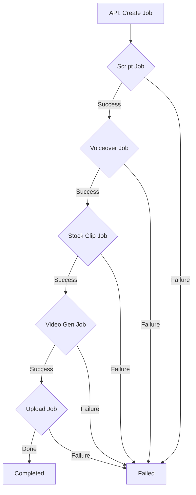

# Job Lifecycle & State Machine

Velox uses a distributed job queue system to manage asynchronous tasks such as script generation, video rendering, and uploads.

## Job Types

Jobs are defined by the `JobType` enum in `pkg/models/job_types.go`:

| Type | Description |
| :--- | :--- |
| `script_generation` | LLM-based script creation from source text or YouTube. |
| `voiceover` | TTS generation for a given script. |
| `stock_clip` | Matching and downloading stock footage. |
| `video_generation` | Final assembly using the Rust Video Engine. |
| `upload` | Pushing results to Google Drive or YouTube. |

## Job States

The system implements the following state machine:

1.  **`pending`**: Job created but not yet placed in the active queue.
2.  **`queued`**: Job is in the database and ready to be picked up by a worker.
3.  **`processing` / `running`**: A worker has claimed the job and is executing the payload.
4.  **`completed`**: Terminal state; the job finished successfully. Result is available in `Result` field.
5.  **`failed`**: Terminal state; the job encountered an error. Error details in `Error` field.
6.  **`retrying`**: A transient state before the job is moved back to `queued` after a failure (if `MaxRetries` > `RetryCount`).
7.  **`cancelled`**: Manually stopped by the user.

## Flow of a Video Generation Request

A typical "Full Video" pipeline follows this sequence of jobs:

## Worker Lease System
To prevent multiple workers from executing the same job, Velox uses an atomic "Lease" mechanism:
- Workers fetch jobs where `status = 'queued'` and `lease_expiry < NOW()`.
- Upon selection, the worker updates the `status` to `processing` and sets a `lease_expiry` (default 5-30 mins).
- If a worker crashes, the lease will eventually expire, and another worker will pick up the job.

## Database Implementation
Jobs are stored in the `jobs` table within `velox.db.sqlite`.
Persistence is managed by `internal/core/job/service.go` using the `StorageInterface`.
