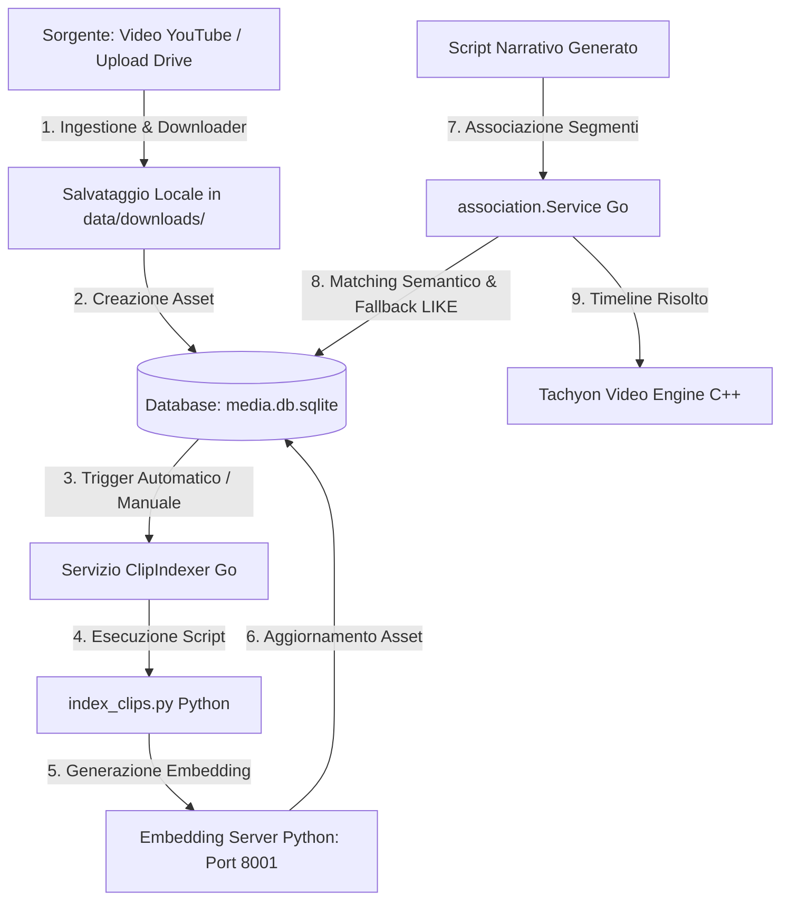

# Guida di Riferimento: Integrazione e Matching delle Clip Personali (Drive/YouTube)

Questo documento spiega nel dettaglio il funzionamento dell'architettura di PipelineGen per l'ingestione, l'indicizzazione, la ricerca semantica e l'associazione automatica delle tue **clip personali** (estratte da YouTube o caricate da Google Drive) all'interno degli script e delle timeline video finali.

---

## 1. Architettura Generale e Flusso dei Dati

L'intero ciclo di vita di una clip personale segue un flusso integrato composto da moduli scritti in **Go** (per l'orchestrazione backend, l'API Gin e il database) e in **Python** (per il calcolo delle analogie semantiche e l'elaborazione dei vettori tramite modelli di Machine Learning).



---

## 2. Lo Schema Unificato del Database (`media_assets`)

Tutte le clip e le risorse multimediali sono centralizzate all'interno del database unificato `data/media/media.db.sqlite` nella tabella principale `media_assets`. 

Per massimizzare la flessibilità ed evitare di alterare continuamente lo schema SQL fisicamente, le proprietà specifiche di ciascun tipo di media sono memorizzate come coppie chiave-valore all'interno di una colonna JSON denominata `metadata_json`.

### Campi Principali della Tabella `media_assets`
- **`id`**: Chiave primaria univoca della risorsa (es. hash del video o ID generato).
- **`source`**: Identifica la sorgente della risorsa. Per le tue clip personali/YouTube, questo valore è rigorosamente **`"youtube"`**. Per le clip commerciali è `"artlist"`, e per i video generici è `"stock"`.
- **`name`**: Nome visuale o titolo descrittivo del file.
- **`tags`**: Array JSON contenente i tag estratti o assegnati (es. `["dog", "running", "grass"]`).
- **`embedding_json`**: Vettore di embedding semantico a 384 dimensioni generato dal modello `all-MiniLM-L6-v2`.

### Campi Dinamici in `metadata_json` (Estratti via SQL `json_extract`)
- **`search_text`**: Testo normalizzato e arricchito usato per le ricerche testuali ad alte prestazioni.
- **`drive_link`**: Link di condivisione di Google Drive per il download o lo streaming.
- **`local_path`**: Percorso fisico assoluto o relativo sul file system locale (es. `data/downloads/clip_123.mp4`).
- **`category` & `scene_type`**: Metadati descrittivi della scena per filtri avanzati.
- **`quality_score`**: Punteggio numerico (da `0.0` a `10.0`) calcolato per misurare la risoluzione o l'estetica.
- **`reuse_count`**: Contatore di quante volte questa clip è stata inclusa in timeline passate, usato per evitare ripetizioni monotone.

---

## 3. Workflow di Ingestione ed Indicizzazione Semantica

### Fase 3.1: Ingestione delle Clip
Quando viene estratta una clip da YouTube o indicizzata una risorsa da Google Drive:
1. Il video viene salvato nella cartella `data/downloads/` o `data/youtube-clips/`.
2. Viene inserito un record in `media_assets` con `source = 'youtube'` e i metadati di base (ID, nome, link Drive se caricato).

### Fase 3.2: Indicizzazione Semantica (Machine Learning)
Il Go-backend lancia in background il servizio `clipindexer`, il quale a sua volta delega il lavoro a due componenti chiave:

1. **`scripts/index_clips.py`**:
   - Recupera le clip prive di embeddings.
   - **Supporto File di Descrizione `.txt`**: Cerca automaticamente se esiste un file di testo associato alla clip (es. `nome_clip.txt` accanto a `nome_clip.mp4` nella cartella locale, oppure cercandolo ricorsivamente per nome). Se il file esiste, ne legge il contenuto testuale e lo utilizza come descrizione primaria della clip.
   - Normalizza i tag, il nome del file e l'eventuale descrizione `.txt` rimuovendo parole di arresto (*stopwords*) e punteggiatura, convertendo il tutto in lemmi (grazie alla libreria NLP **SpaCy**).
   - Genera il testo di ricerca normalizzato (`search_text`) combinando: `[nome] + [descrizione .txt] + [tag]`.
   - Calcola il vettore di embedding tramite la libreria **SentenceTransformers** (modello `all-MiniLM-L6-v2`).
   - Salva i dati aggiornando `embedding_json` e `metadata_json` all'interno di `media.db.sqlite`.
   - **Indicizzazione Visiva (Opzionale)**: Estrae un frame a `1s` con FFmpeg e calcola l'embedding visivo tramite il modello CLIP (`clip-ViT-B-32`) per consentire ricerche "Text-to-Image" (ossia trovare un video descrivendone l'aspetto visivo).

2. **`scripts/embedding_server.py`** (FastAPI in ascolto sulla porta `8001`):
   - Mantiene in RAM una matrice degli embeddings pre-caricati per calcoli fulminei tramite **NumPy**.
   - Espone l'endpoint `/search` per calcolare la similarità cosina (*Cosine Similarity*) tra una stringa di query digitata dall'utente e tutti gli embeddings dei video registrati nel database.

---

## 4. Il Motore di Associazione (`association.Service`)

Durante la generazione di un video, lo script narrativo viene suddiviso in diversi segmenti di testo. Ogni segmento richiede una clip di sfondo ideale. Il modulo `internal/media/association/` si occupa di trovare la risorsa perfetta.

### Il Ruolo di `ClipDriveAssociation`
Per accoppiare le tue clip personali, abbiamo abilitato `ClipDriveAssociation`. Quando l'engine analizza un segmento di script:
1. Chiama il metodo `SearchClips` sul repository, passando come filtro la sorgente `"youtube"`.
2. Cerca nel database `media_assets` tutte le clip personali i cui tag o nomi corrispondono semanticamente o testualmente al soggetto del segmento dello script.
3. Assegna un punteggio (*Score*) a ciascun candidato trovato.

### Regole di Priorità e Boosting
L'engine implementa una gerarchia intelligente per selezionare i video:
- Le **clip locali / stock di Google Drive** hanno la priorità assoluta per evitare costi di download o API esterne.
- Nel metodo `Associate`, le risorse locali ricevono un **boost di +50 punti** al loro punteggio di similarità cosina per fare in modo che vengano preferite rispetto a video da scaricare al momento.

---

## 5. Algoritmo di Ricerca e Risoluzione dei Candidati (`clipresolver`)

Quando il risolutore semantico cerca i video candidati all'interno di `clipcatalog.Repository`, esegue una cascata (*fallback*) a 3 livelli per massimizzare la robustezza ed evitare di restituire zero risultati:

### Livello 1: Ricerca Semantica (Embedding ML)
Invia la query testuale all'embedding server locale (`http://127.0.0.1:8001/search`). L'embedding server risponde con una lista ordinata di ID di clip basata sul calcolo vettoriale.
Go riceve gli ID e scarica i dettagli dal DB tramite la query:
```sql
SELECT id, name,
       COALESCE(json_extract(metadata_json, '$.search_text'), ''),
       COALESCE(json_extract(metadata_json, '$.category'), ''),
       COALESCE(json_extract(metadata_json, '$.scene_type'), ''),
       COALESCE(tags, '[]'),
       COALESCE(json_extract(metadata_json, '$.drive_link'), ''),
       COALESCE(json_extract(metadata_json, '$.local_path'), ''),
       COALESCE(CAST(json_extract(metadata_json, '$.quality_score') AS REAL), 0.0),
       COALESCE(CAST(json_extract(metadata_json, '$.reuse_count') AS INTEGER), 0),
       COALESCE(json_extract(metadata_json, '$.usable_for'), '[]'),
       COALESCE(json_extract(metadata_json, '$.avoid_for'), '[]')
FROM media_assets
WHERE id IN (?, ?, ...) AND (? = '' OR source = ?)
```

### Livello 2: Ricerca FTS5 (Full-Text Search)
Se l'embedding server è offline o la ricerca fallisce, Go prova a usare il modulo virtuale SQLite FTS5 per un calcolo dell'indice invertito (ranking BM25).

### Livello 3: Ricerca Lineare LIKE (Massima Sicurezza)
Se FTS5 non è compilato nel driver SQLite corrente (limite comune di molti sistemi), il database esegue istantaneamente un fallback su query `LIKE` concatenate per token testuali normalizzati:
```sql
SELECT id, name, ...
FROM media_assets
WHERE (search_text LIKE ? AND search_text LIKE ?) AND (? = '' OR source = ?)
ORDER BY quality_score DESC, reuse_count ASC
LIMIT ?
```

Questo garantisce che, anche in condizioni di emergenza o offline, **le tue clip vengano sempre trovate e associate con successo**.
