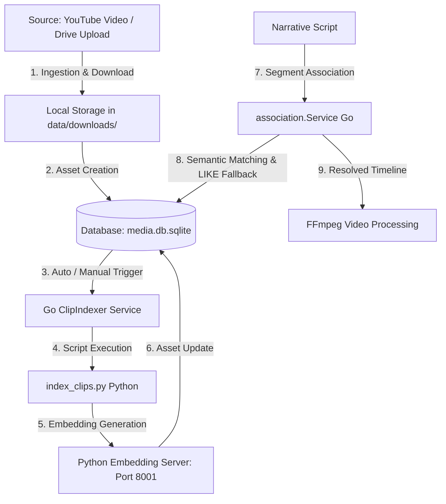

# Reference Guide: Personal Clip Integration & Matching (Drive/YouTube)

This document explains in detail how PipelineGen handles ingestion, indexing, semantic search, and automatic association of your **personal clips** (extracted from YouTube or uploaded from Google Drive) within scripts and final video timelines.

---

## 1. Architecture Overview and Data Flow

The entire lifecycle of a personal clip follows an integrated flow composed of **Go** modules (for backend orchestration, Gin API and database) and **Python** modules (for semantic similarity computation and vector processing via Machine Learning models).



---

## 2. Unified Database Schema (`media_assets`)

All clips and media resources are centralized in the unified database `data/media/media.db.sqlite` in the main table `media_assets`.

To maximize flexibility and avoid constantly altering the SQL schema, source-specific properties are stored as key-value pairs in a `metadata_json` JSON column.

### Main Fields of the `media_assets` Table
- **`id`**: Unique primary key (e.g., video hash or generated ID).
- **`source`**: Identifies the resource source. For personal/YouTube clips this is `"youtube"`, for commercial clips `"artlist"`, for generic videos `"stock"`.
- **`name`**: Display name or descriptive title.
- **`tags`**: JSON array of extracted or assigned tags (e.g., `["dog", "running", "grass"]`).
- **`embedding_json`**: 384-dimensional semantic embedding vector from `all-MiniLM-L6-v2`.

### Dynamic Fields in `metadata_json` (Extracted via SQL `json_extract`)
- **`search_text`**: Normalized and enriched text for high-performance textual search.
- **`drive_link`**: Google Drive share link for download or streaming.
- **`local_path`**: Absolute or relative file system path (e.g., `data/downloads/clip_123.mp4`).
- **`category` & `scene_type`**: Scene descriptive metadata for advanced filtering.
- **`quality_score`**: Numeric score (0.0 to 10.0) measuring resolution or aesthetics.
- **`reuse_count`**: Counter of how many times this clip has been used in past timelines, to avoid monotony.

---

## 3. Ingestion and Semantic Indexing Workflow

### Phase 3.1: Clip Ingestion
When a clip is extracted from YouTube or indexed from Google Drive:
1. The video is saved to `data/downloads/` or `data/youtube-clips/`.
2. A record is inserted into `media_assets` with `source = 'youtube'` and basic metadata.

### Phase 3.2: Semantic Indexing (Machine Learning)
The Go backend launches the `clipindexer` service in the background, which delegates to two key components:

1. **`scripts/index_clips.py`**:
   - Fetches clips without embeddings.
   - **Description File `.txt` Support**: Automatically looks for an associated text file (e.g., `name_clip.txt` next to `name_clip.mp4`, or recursively by name). If found, uses its text content as the primary clip description.
   - Normalizes tags, filename and optional `.txt` description by removing stopwords and punctuation, converting to lemmas (via **SpaCy** NLP library).
   - Generates normalized search text (`search_text`) by combining: `[filename] + [.txt description] + [tags]`.
   - Computes the embedding vector via **SentenceTransformers** (`all-MiniLM-L6-v2`).
   - Saves updated `embedding_json` and `metadata_json` to `media.db.sqlite`.
   - **Visual Indexing (Optional)**: Extracts a frame at `1s` with FFmpeg and computes a visual embedding via CLIP (`clip-ViT-B-32`) for Text-to-Image search.

2. **`scripts/embedding_server.py`** (FastAPI listening on port `8001`):
   - Keeps a pre-loaded embedding matrix in RAM for fast **NumPy** computations.
   - Exposes `/search` endpoint for Cosine Similarity between a user query and all video embeddings in the database.

---

## 4. The Association Engine (`association.Service`)

During video generation, the narrative script is split into text segments. Each segment needs an ideal background clip. The `internal/media/association/` module finds the perfect match.

### The Role of `ClipDriveAssociation`
To match your personal clips, `ClipDriveAssociation` is enabled. When the engine analyzes a script segment:
1. It calls `SearchClips` on the repository, filtering by source `"youtube"`.
2. It searches `media_assets` for personal clips whose tags or names match semantically or textually with the script segment subject.
3. It assigns a score to each candidate.

### Priority and Boosting Rules
The engine implements an intelligent hierarchy for video selection:
- **Local / Google Drive stock clips** have absolute priority to avoid download costs or external API calls.
- In the `Associate` method, local resources receive a **+50 point boost** to their cosine similarity score, ensuring they are preferred over remote videos.

---

## 5. Search Algorithm and Candidate Resolution (`clipresolver`)

When the semantic resolver searches for candidate videos in `clipcatalog.Repository`, it runs a 3-level cascade fallback to maximize robustness:

### Level 1: Semantic Search (ML Embedding)
Sends the text query to the local embedding server (`http://127.0.0.1:8001/search`). The server responds with an ordered list of clip IDs based on vector computation.
Go receives the IDs and fetches details from the DB:

```sql
SELECT id, name,
       COALESCE(json_extract(metadata_json, '$.search_text'), ''),
       COALESCE(json_extract(metadata_json, '$.category'), ''),
       COALESCE(json_extract(metadata_json, '$.scene_type'), ''),
       COALESCE(tags, '[]'),
       COALESCE(json_extract(metadata_json, '$.drive_link'), ''),
       COALESCE(json_extract(metadata_json, '$.local_path'), ''),
       COALESCE(CAST(json_extract(metadata_json, '$.quality_score') AS REAL), 0.0),
       COALESCE(CAST(json_extract(metadata_json, '$.reuse_count') AS INTEGER), 0),
       COALESCE(json_extract(metadata_json, '$.usable_for'), '[]'),
       COALESCE(json_extract(metadata_json, '$.avoid_for'), '[]')
FROM media_assets
WHERE id IN (?, ?, ...) AND (? = '' OR source = ?)
```

### Level 2: FTS5 Full-Text Search
If the embedding server is offline or search fails, Go tries the SQLite FTS5 virtual module for inverted index ranking (BM25).

### Level 3: LIKE Linear Search (Maximum Safety)
If FTS5 is not compiled into the current SQLite driver (a common limitation), the database instantly falls back to concatenated `LIKE` queries:

```sql
SELECT id, name, ...
FROM media_assets
WHERE (search_text LIKE ? AND search_text LIKE ?) AND (? = '' OR source = ?)
ORDER BY quality_score DESC, reuse_count ASC
LIMIT ?
```

This guarantees that even in emergency or offline conditions, **your clips are always found and associated successfully**.
