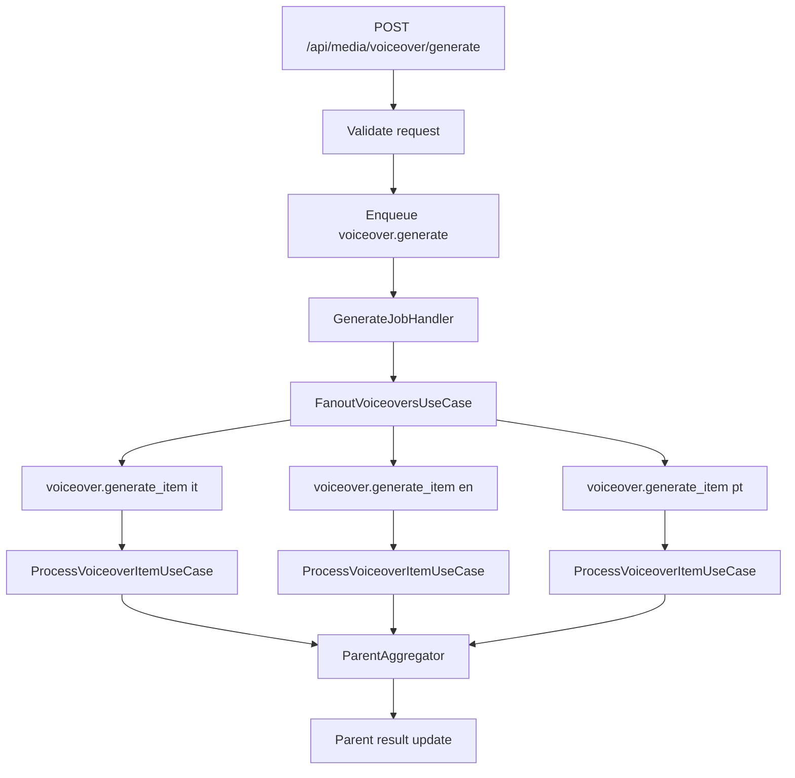
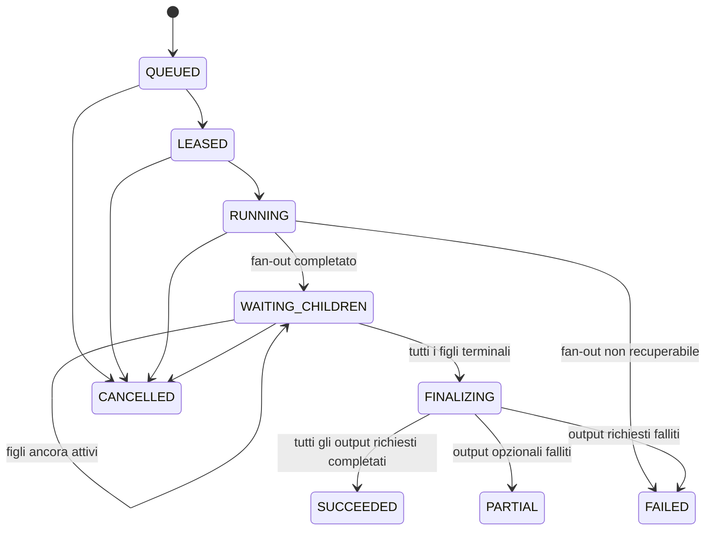
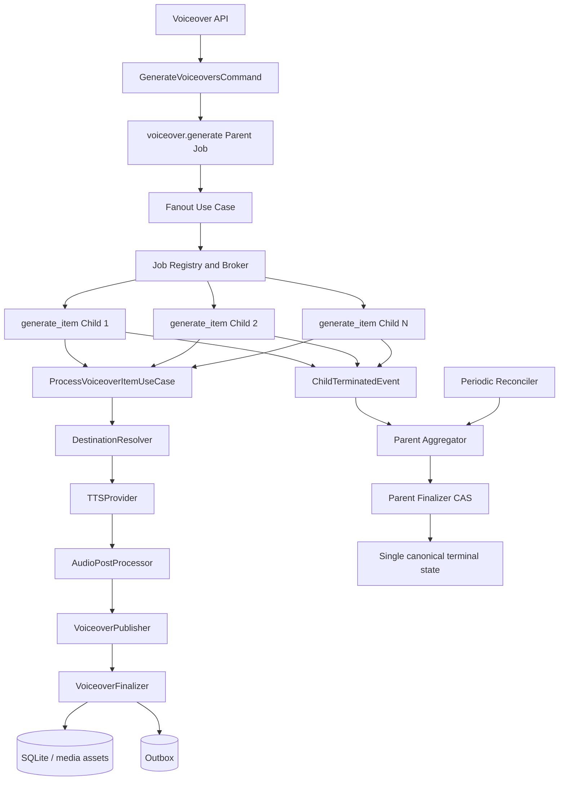

# Voiceover Architecture

## Stato del documento

- **Progetto:** PipelineGen
- **Repository:** `Marcuss-ops/PipelineGen`
- **Branch di riferimento:** `main`
- **Ambito:** generazione, pubblicazione, persistenza e monitoraggio dei voiceover
- **Obiettivo:** descrivere con precisione l'architettura attuale, il comportamento desiderato e il lavoro ancora necessario per raggiungere un sistema realmente canonico, affidabile e scalabile

---

## 1. Executive summary

Il sistema Voiceover di PipelineGen è già passato da una prima architettura sincrona e monolitica a una struttura più robusta basata su job asincroni, fan-out per lingua, porte tipizzate e finalizzazione transazionale.

La direzione architetturale è corretta:

```text
HTTP request
    -> voiceover.generate parent job
    -> N voiceover.generate_item child jobs
    -> pipeline per singola lingua
    -> TTS
    -> post-processing audio
    -> pubblicazione
    -> finalizzazione atomica
    -> aggregazione dei risultati dei figli
    -> stato terminale del parent
```

Tuttavia, la migrazione non è ancora completa.

Il problema principale è che oggi il **job padre può essere marcato tecnicamente come `SUCCEEDED` appena termina il fan-out**, anche se i job figli non hanno ancora generato nessun file. Il risultato applicativo prova a compensare questa situazione con il campo `parent_state="waiting_children"`, ma questo crea due verità concorrenti:

```text
job.status = SUCCEEDED
result.parent_state = waiting_children
```

Questa ambiguità deve essere eliminata. Il job padre deve restare non terminale fino alla conclusione reale di tutti i figli.

Inoltre convivono ancora due percorsi:

1. il nuovo percorso canonico `voiceover.generate` + `voiceover.generate_item`;
2. il percorso legacy `voiceover.batch` e `voiceover.promo`, ancora registrato sul vecchio `Service`.

L'obiettivo finale deve essere un solo modello operativo:

```text
un solo contratto pubblico
un solo job padre
un solo job figlio per output
una sola pipeline per-item
un solo finalizer
una sola verità sullo stato
```

---

# 2. Obiettivi del sistema Voiceover

Il sistema deve ricevere uno o più testi, associati a una lingua e a una voce, e produrre asset audio durevoli.

Ogni output deve avere almeno:

- lingua;
- voce utilizzata;
- hash del testo;
- nome file deterministico;
- percorso locale temporaneo o definitivo;
- identificativo Drive, quando previsto;
- link Drive, quando previsto;
- stato finale;
- eventuale errore;
- riferimento al parent job;
- riferimento alla richiesta originale;
- record persistente nel catalogo;
- evento di indicizzazione o cleanup, quando necessario.

Il sistema deve garantire:

1. **idempotenza**;
2. **retry indipendente per lingua**;
3. **assenza di falsi successi**;
4. **assenza di doppie pubblicazioni**;
5. **stato parent coerente con lo stato reale dei figli**;
6. **finalizzazione atomica**;
7. **tracciabilità completa parent-child**;
8. **separazione netta tra transport, orchestration, provider e persistence**;
9. **fail-fast in fase di composizione**;
10. **nessun percorso legacy capace di aggirare la pipeline canonica**.

---

# 3. Architettura attuale

## 3.1 Panoramica

L'architettura attuale è composta da cinque blocchi principali:

1. **HTTP API**
2. **Parent job handler**
3. **Fan-out use case**
4. **Child job handler e pipeline per-item**
5. **Parent aggregator**

Diagramma semplificato:



---

## 3.2 Superficie HTTP pubblica

La superficie canonica è:

```http
POST /api/media/voiceover/generate
```

Il relativo handler è volutamente sottile.

Le sue responsabilità sono:

1. leggere il JSON;
2. validare il contratto pubblico;
3. convertirlo nel comando interno;
4. creare un job `voiceover.generate`;
5. restituire `202 Accepted`.

Il transport non deve:

- chiamare direttamente il provider TTS;
- creare goroutine;
- generare file;
- caricare file su Drive;
- inserire record nel database;
- calcolare il risultato finale del parent.

La risposta attuale segue concettualmente questa forma:

```json
{
  "ok": true,
  "job_id": "job-parent-id",
  "request_id": "caller-request-id",
  "status": "queued",
  "total_outputs": 3
}
```

Il contratto pubblico contiene:

- `request_id`;
- `items[]`;
- destinazione;
- opzioni di processamento;
- strategia;
- parallelismo dichiarativo.

Il parallelismo reale non deve essere deciso dall'API. Deve essere controllato dal registry dei job.

### Invariante

```text
L'API accetta la richiesta.
Il job system possiede l'esecuzione.
```

---

# 4. Parent job: `voiceover.generate`

## 4.1 Ruolo

Il job padre rappresenta una richiesta logica di generazione voiceover.

Esempio:

```text
Genera lo stesso contenuto in:
- italiano con voce A
- inglese con voce B
- portoghese con voce C
```

Il parent non deve generare direttamente l'audio. Deve solamente:

1. validare il comando;
2. normalizzare request ID e correlazione;
3. creare un child job per ogni coppia lingua-voce;
4. registrare gli ID dei figli;
5. passare allo stato `WAITING_CHILDREN`;
6. attendere la finalizzazione aggregata.

## 4.2 Fan-out

Il `FanoutVoiceoversUseCase` crea un job figlio per ogni output.

Esempio:

```text
Parent P1
    -> Child C1: italiano / it-IT-Elsa
    -> Child C2: inglese / en-US-Aria
    -> Child C3: portoghese / pt-BR-Francisca
```

Il fan-out deve calcolare una sola volta i campi deterministici:

- `RequestID`;
- `ParentJobID`;
- `TextHash`;
- `Voice`;
- `Filename`;
- `Language`;
- `Destination`;
- `RemoveSilence`;
- policy e strategia.

Il child deve ricevere questi valori già risolti e non deve ricalcolarli.

Questa scelta è corretta perché evita divergenze come:

```text
parent calcola filename A
child ricalcola filename B
repository salva B
manifest cerca A
```

## 4.3 Fallimento parziale del fan-out

Se il parent deve creare 5 child job e riesce a crearne solo 3, non può dichiarare successo pieno.

Il risultato deve contenere:

- numero previsto;
- numero accodato;
- numero fallito;
- ID dei job creati;
- errore per ogni output non accodato;
- stato applicativo `partial_success` oppure `fanout_failed`.

Il comportamento attuale riconosce questa condizione e restituisce un errore al dispatcher. Questa parte è corretta.

Tuttavia, bisogna definire una policy definitiva:

### Opzione raccomandata

Il parent resta `FAILED` se non riesce a creare tutti i child richiesti.

I child già creati possono essere:

- lasciati completare per audit;
- marcati come orphaned;
- collegati al parent fallito;
- eventualmente riusati durante un retry idempotente.

Il retry del parent non deve creare duplicati. Deve usare chiavi attive deterministiche per figlio.

Esempio:

```text
voiceover-item:{request_id}:{language}:{voice}:{text_hash}:{destination_id}
```

---

# 5. Child job: `voiceover.generate_item`

## 5.1 Responsabilità

Ogni child rappresenta un solo output reale.

Un child deve essere completamente indipendente dagli altri.

Questo significa:

- retry autonomo;
- timeout autonomo;
- lease autonomo;
- stato autonomo;
- risultato autonomo;
- nessuna goroutine interna per generare altri output;
- nessuna dipendenza da un batch in memoria.

Il registry attuale limita la concorrenza dei child job. Questa è la sede corretta per il throttling.

## 5.2 Validazione

Prima di iniziare il lavoro, il child deve verificare:

- testo non vuoto;
- lingua valida;
- voce non vuota o risolvibile;
- filename valido;
- request ID presente;
- parent job ID presente;
- destinazione valida o default risolvibile;
- opzioni coerenti.

Nota (FASE 2, July 2026): il campo `TextHash` è pre-calcolato dal
fan-out e usato verbatim dalla pipeline (P0.6 invariant), ma
`GenerateVoiceoverItemCommand.Validate()` non lo controlla
esplicitamente — il fan-out è il garante della presenza.

Un errore di validazione è generalmente **permanente**.

Non deve essere ritentato automaticamente salvo modifica del payload.

---

# 6. Pipeline canonica per singolo voiceover

La pipeline attuale è implementata da `ProcessVoiceoverItemUseCase`.

La sua struttura è vicina all'architettura target.

## 6.1 Stage 0: pre-flight validation

Input:

```text
GenerateVoiceoverItemCommand
```

Controlli:

- item non nullo;
- campi obbligatori;
- coerenza lingua-voce;
- integrità dei riferimenti;
- validità della destinazione.

Output in caso di errore:

```text
nil result + permanent error
```

## 6.2 Stage 0b: destination resolution

La destinazione deve essere risolta prima della sintesi.

Motivo:

- il provider può avere bisogno della directory locale;
- il filename può dipendere dal namespace;
- l'ID deterministico può includere la folder di destinazione;
- tutte le fasi successive devono usare la stessa destinazione.

Ordine raccomandato:

```text
explicit destination
    > destination group resolver
    > configured default voiceover folder
    > permanent missing-destination error
```

Il sistema non deve inventare una destinazione silenziosa.

## 6.3 Stage 1: TTS synthesis

Porta:

```go
TTSProvider.Synthesize(...)
```

Input principali:

- testo;
- lingua;
- voce;
- filename;
- output directory.

Output principali:

- percorso locale;
- voce realmente usata;
- hash del file;
- eventuale cleaned path, se prodotto dal provider legacy.

### Regola importante

La rimozione del silenzio non deve essere eseguita dal provider TTS e poi ripetuta dal postprocessor.

Il provider deve ricevere:

```text
RemoveSilence = false
```

La responsabilità appartiene esclusivamente allo stage audio successivo.

Questo evita:

- doppio processamento;
- consumo CPU inutile;
- degradazione audio;
- output non deterministico.

### Classificazione errore

Un errore TTS può essere retryable quando deriva da:

- timeout;
- rate limit;
- indisponibilità temporanea;
- errore di rete;
- processo esterno terminato in modo anomalo.

Può essere permanente quando deriva da:

- voce inesistente;
- lingua non supportata;
- input invalido;
- payload troppo grande non segmentabile.

La classificazione non deve essere basata soltanto su substring generiche. Idealmente il provider deve restituire errori tipizzati.

## 6.4 Stage 2: audio post-processing

Porta:

```go
AudioPostProcessor.Process(...)
```

Responsabilità possibili:

- rimozione silenzi;
- normalizzazione volume;
- conversione formato;
- controllo durata;
- verifica che il file non sia vuoto;
- controllo integrità audio.

Questa fase deve essere opzionale e attivata solo dalla policy.

### Output canonico

Il sistema deve stabilire un solo path finale:

```text
final_local_path
```

La logica non dovrebbe costringere i consumer a scegliere continuamente tra:

```text
LocalPath
CleanedPath
ProcessedPath
OutputPath
```

Questi possono restare metadati diagnostici, ma deve esistere un campo autorevole.

## 6.5 Stage 3: publication

Porta:

```go
VoiceoverPublisher.Publish(...)
```

La pubblicazione può includere:

- upload su Google Drive;
- copia nello storage canonico;
- creazione di una location;
- ritorno di Drive file ID e link.

La pubblicazione non deve finalizzare da sola il job.

Deve restituire un risultato tipizzato:

```go
PublishedVoiceover {
    LocalPath
    DriveFileID
    DriveLink
    SizeBytes
    SHA256
    MIMEType
}
```

## 6.6 Stage 4: finalizzazione atomica

Questo è il confine più importante.

Il finalizer deve essere l'unico owner delle scritture finali.

All'interno di una transazione deve eseguire, quando applicabile:

1. verifica deduplica;
2. eliminazione o superseding della versione precedente;
3. inserimento del nuovo voiceover;
4. proiezione in `media_assets`;
5. creazione di asset version;
6. creazione di asset location;
7. inserimento evento outbox di indicizzazione;
8. inserimento evento outbox di cleanup;
9. commit;
10. eventuale verifica post-commit.

### Invariante

```text
Nessun handler, provider o service legacy deve replicare queste scritture.
```

Se TTS e upload riescono ma il commit database fallisce, il child deve fallire.

Il sistema non può rispondere `completed` soltanto perché esiste un file su Drive.

## 6.7 Stage 5: post-commit verification

Una verifica post-commit opzionale può controllare:

- esistenza del record voiceover;
- esistenza della location;
- corrispondenza hash;
- presenza del Drive file ID;
- presenza dell'evento outbox;
- assenza di duplicati attivi.

La verifica deve distinguere:

- errore di lettura temporaneo;
- violazione reale di consistenza.

---

# 7. Contratto del risultato child

Il child deve produrre un risultato tipizzato simile a:

```json
{
  "ok": true,
  "status": "completed",
  "job_id": "child-job-id",
  "parent_job_id": "parent-job-id",
  "request_id": "request-id",
  "language": "it",
  "voice": "it-IT-ElsaNeural",
  "voiceover_id": "deterministic-id",
  "text_hash": "...",
  "file_hash": "...",
  "local_path": "...",
  "drive_file_id": "...",
  "drive_link": "...",
  "error": ""
}
```

## Regola anti-falso-successo

Il job può essere `SUCCEEDED` soltanto se:

```text
result != nil
AND result.status == completed
AND result.ok == true
AND finalization committed
```

Qualunque altro risultato deve generare un errore del dispatcher.

Questo controllo è già presente nel nuovo child handler ed è uno degli elementi migliori dell'architettura corrente.

---

# 8. Parent aggregator attuale

## 8.1 Come funziona oggi

L'aggregatore:

1. parte come background poller;
2. ogni intervallo legge i parent `voiceover.generate`;
3. deserializza il loro risultato;
4. seleziona quelli con `parent_state` non terminale;
5. legge tutti i child job;
6. controlla stato broker e `result.ok`;
7. calcola il risultato aggregato;
8. aggiorna il risultato del parent.

Il controllo secondario su `result.ok` è importante, perché protegge da child storici che potrebbero essere stati marcati `SUCCEEDED` dal broker nonostante un risultato applicativo fallito.

## 8.2 Problema strutturale

L'aggregatore usa ora `FinalizeAggregateParent` con CAS sulla versione (FASE 2,
July 2026) per re-finalizzare il parent:

```go
finalizeParent(parentID, VoiceoverAggregateResult{...})
    → jobsSvc.FinalizeAggregateParent(ctx, id, targetStatus, resultMap, errMsg, expectedVersion)
```

FASE 2 permette all'aggregatore di impostare `FAILED` o `SUCCEEDED`
reali sul broker, non solo modificare il JSON del risultato. Il CAS
(`AND revision = expectedVersion`) protegge da race condition con
altri writer concorrenti.

Tuttavia, il parent viene ancora marcato broker-`SUCCEEDED` dal
fan-out handler (generate_handler.go restituisce `nil` error dopo
il fan-out completo). L'aggregatore poi re-finalizza via
`FinalizeAggregateParent`. La doppia macchina a stati è ridotta ma non ancora
eliminata:

```text
Fan-out handler → broker SUCCEEDED (temporaneo)
Aggregator tick → FinalizeAggregateParent → broker SUCCEEDED/FAILED (definitivo)
```

La macchina a stati target (§9) prevede che il parent resti
non-terminale dopo il fan-out e che l'aggregatore sia il **solo**
writer terminale.

---

# 9. Macchina a stati attuale e target

## 9.1 Domain StateMachine (attuale, FASE 1)

La `StateMachine` in `internal/domain/job/parent_state.go` (FASE 1,
July 2026) implementa una macchina a 5 stati:

```text
Dispatching → WaitingChildren → Aggregating → Succeeded
                                            → FailedTerminal
```

Transizioni:
- `TransitionToWaitingChildren(childIDs)` — esplicita dopo il fan-out
- `Transition(ChildTerminatedEvent)` — per ogni child terminale
  - Rule ①: REQUIRED-failed → FailedTerminal immediato
  - Rule ②: Dispatching → WaitingChildren (fallback se TransitionToWaitingChildren non chiamata)
  - Rule ③: WaitingChildren → Aggregating (ultimo child)
- `Compute()` — Aggregating → Succeeded o FailedTerminal

Questi stati vivono nel **result map** (`parent_state`) e nella
memoria dell'aggregatore, NON negli stati broker del job.

## 9.2 Macchina a stati target (broker-level)

La macchina a stati desiderata è unica e vive a livello broker:



⚠️ **Oggi il broker non ha `WAITING_CHILDREN` / `FINALIZING` / `PARTIAL`.**
Il fan-out handler restituisce `nil` → broker `SUCCEEDED`. L'aggregatore
re-finalizza via `FinalizeAggregateParent`. Il gap principale è far sì che il parent
resti broker-non-terminale dopo il fan-out (forward-pointer).

---

# 10. Cosa manca nell'architettura attuale

## 10.1 Parent terminalizzato troppo presto

### Situazione attuale (post-FASE 1)

✅ `TransitionToWaitingChildren` implementata (domain `StateMachine`).
✅ `FinalizeAggregateParent` con version CAS implementato (aggregatore può re-finalizzare).
⚠️ Il fan-out handler restituisce ancora `nil` error → broker `SUCCEEDED`.

L'aggregatore corregge lo stato broker via `FinalizeAggregateParent`, ma il parent
non è ancora veramente non-terminale al momento del fan-out.

### Situazione target

Il parent resta broker-non-terminale (`RUNNING` o `WAITING_CHILDREN`)
finché tutti i child non sono terminali. L'aggregatore è il **solo**
writer del terminal flip.

### Intervento residuo

Il fan-out handler deve restituire un errore (o un segnale) che impedisca
al broker di marcare `SUCCEEDED`. Possibili strade:
- Fan-out handler restituisce `error` non-nil ma non-fatale (broker resta `RUNNING`)
- Introduzione di `WAITING_CHILDREN` come stato broker nativo
- `job.phase = "waiting_children"` con status `RUNNING`

---

## 10.2 Legacy `voiceover.batch` ancora registrato

### Situazione attuale

Il vecchio `Service` registra ancora:

```text
voiceover.batch
voiceover.promo
```

Questo mantiene attivi due motori:

```text
legacy Service.GenerateBatch
canonical ProcessVoiceoverItemUseCase
```

### Rischio

Le due pipeline possono divergere su:

- naming;
- destination resolution;
- upload;
- transazioni;
- outbox;
- retry;
- verifiche;
- risultato.

### Intervento

Migrare ogni caller legacy verso:

```text
voiceover.generate
```

Per il promo:

```text
translate
    -> costruisci items tipizzati
    -> enqueue voiceover.generate
```

La traduzione non deve possedere una seconda pipeline TTS.

---

## 10.3 Registrazione legacy non fail-closed

La registrazione legacy ignora gli errori e tollera un broker nullo.

Il comportamento target deve essere:

```go
func RegisterHandler(jobsSvc Broker) error
```

Con:

- errore se `jobsSvc == nil`;
- errore se il tipo è già registrato;
- errore propagato fino alla composition root;
- boot interrotto quando manca un handler obbligatorio.

---

## 10.4 Risultati ancora convertiti in `map[string]any`

✅ **FASE 2 (July 2026): parzialmente risolto.** L'aggregatore
usa ora DTO tipizzati internamente:
- `VoiceoverParentResult` — deserializzazione del parent job result
- `VoiceoverChildResult` — deserializzazione del child job result (P0.1 gate)
- `VoiceoverChildPayload` — deserializzazione del child job payload (Required flag)
- `VoiceoverAggregateResult` — output dell'aggregazione, passato a `finalizeParent`

Le definizioni vivono in `internal/application/voiceover/jobs/result_dto.go`.

Il boundary verso il broker (`FinalizeAggregateParent`, `map[string]any`) è
ancora generico — la conversione avviene solo al confine ultimo.

Handler (`generate_handler.go`, `generate_item_handler.go`) usano
ancora `map[string]any` per i result map — migrazione futura.

---

## 10.5 Polling non indicizzato dell'aggregatore

⚠️ **Ancora aperto (July 2026).** L'aggregatore usa:

```go
a.deps.JobsSvc.List(ctx, job.Filter{Type: ptrStr(job.TypeVoiceoverGenerate)})
```

che lista TUTTI i job `voiceover.generate` e filtra `parent_state`
in memoria dopo la deserializzazione (`IsAwaitingAggregation()`).

Con una cronologia grande, questo può diventare costoso.

Target repository query:

```sql
SELECT ...
FROM jobs
WHERE type = 'voiceover.generate'
  AND status IN ('RUNNING', 'FINALIZING')
  AND phase = 'waiting_children'
  AND next_check_at <= CURRENT_TIMESTAMP
ORDER BY next_check_at
LIMIT ?;
```

Serve anche un indice coerente. La query attuale non è ancora
ottimizzata (forward-pointer: `architecture/current.yaml`).

---

## 10.6 Aggregazione via poller invece che evento

Il poller è semplice e può essere mantenuto come reconciler, ma non dovrebbe essere l'unico meccanismo.

Target raccomandato:

```text
child terminalizza
    -> emette ChildTerminatedEvent
    -> parent aggregator consumer riceve evento
    -> rilegge stato canonico dei figli
    -> finalizza parent se tutti terminali
```

Il poller resta come recovery mechanism:

```text
event-driven fast path
poller reconciliation slow path
```

---

## 10.7 Mancanza di una policy chiara required vs optional

✅ **FASE 2 (July 2026): risolto.** Il campo `Required` è stato
aggiunto a:
- `VoiceoverItem` (command.go) — propagato dall'API caller
- `GenerateVoiceoverItemCommand` (command.go) — propagato dal fan-out
- `VoiceoverChildPayload` (result_dto.go) — letto dall'aggregatore

La `StateMachine.Transition()` applica la regola ①: un child
`REQUIRED` fallito short-circuita immediatamente a `FailedTerminal`.

`Compute()` tollera fallimenti OPTIONAL quando almeno un child ha
avuto successo → `ParentStateSucceeded` mappato a
`voiceover.ParentPartialSuccess` quando `len(sm.Failed()) > 0`.

Policy aggregata attuale:
- tutti i required riusciti, optional falliti → `partial_success`;
- almeno un required fallito → `failed` (Transition rule ①);
- tutti riusciti → `succeeded`;
- nessun child creato o tutti falliti → `failed`.

---

## 10.8 Cleanup degli artifact orfani

Possibili casi:

1. TTS crea il file, upload fallisce;
2. upload riesce, finalizzazione DB fallisce;
3. DB riesce, risposta worker viene persa;
4. child viene ritentato dopo publish;
5. parent viene cancellato mentre alcuni figli sono attivi.

Serve una policy esplicita per:

- cleanup locale;
- cleanup Drive;
- riuso di artifact già pubblicati;
- deduplica tramite hash;
- orphan reconciliation.

Il cleanup non deve essere best-effort invisibile. Deve generare un evento persistente.

---

## 10.9 Retry taxonomy incompleta

Ogni errore deve contenere almeno:

```go
Stage
Retryable
Code
Cause
```

Stage possibili:

```text
validation
destination_resolve
tts
audio_post
publish
finalize
post_commit_verify
aggregate
```

Il worker non dovrebbe assumere che tutti gli errori sconosciuti siano retryable all'infinito.

Policy consigliata:

| Stage | Default |
|---|---|
| validation | permanent |
| missing destination | permanent |
| unsupported voice | permanent |
| TTS timeout | retryable |
| provider rate limit | retryable |
| audio corruption | permanent o one retry |
| Drive timeout | retryable |
| Drive permission denied | permanent |
| SQLite busy | retryable |
| unique conflict idempotente | success/reconcile |
| invariant violation | permanent + alert |

---

# 11. Architettura target



## Principi

1. Il parent non è terminale dopo il fan-out.
2. Ogni child possiede un output.
3. Il child usa una sola pipeline.
4. Il finalizer è il solo writer finale.
5. Gli eventi accelerano l'aggregazione.
6. Il poller riconcilia gli eventi persi.
7. Gli stati broker sono autorevoli.
8. Il result JSON descrive il risultato, non corregge lo stato broker.
9. I job legacy vengono eliminati.
10. Tutti i job type hanno handler, codec, retry e timeout registrati centralmente.

---

# 12. Contratti target

## 12.1 Parent command

```go
type GenerateVoiceoversCommand struct {
    Version       int
    RequestID     string
    Items         []GenerateVoiceoverItemSpec
    Destination   *DestinationRequest
    Strategy      Strategy
    RemoveSilence bool
}
```

## 12.2 Item specification

```go
// VoiceoverItem — definito in internal/application/voiceover/command.go
type VoiceoverItem struct {
    Text     string `json:"text"`
    Language string `json:"language"`
    Voice    string `json:"voice,omitempty"`
    Filename string `json:"filename,omitempty"`
    Required bool   `json:"required,omitempty"`  // FASE 2, July 2026
}
```

Nota: il nome canônico è `VoiceoverItem` (non `GenerateVoiceoverItemSpec`).
Il campo `ID` non esiste nel tipo attuale; l'identità del child è
derivata dal fan-out via `buildVoiceoverID(textHash, language, folderID)`.

## 12.3 Child command

```go
type GenerateVoiceoverItemCommand struct {
    ParentJobID  string
    RequestID    string
    ItemID       string
    Text         string
    TextHash     string
    Language     string
    Voice        string
    Filename     string
    Required     bool
    Destination  DestinationRequest
    RemoveSilence bool
}
```

## 12.4 Parent result

```go
// VoiceoverParentResult — definito in internal/application/voiceover/jobs/result_dto.go (FASE 2, July 2026)
type VoiceoverParentResult struct {
    OK                 bool     `json:"ok"`
    ParentJobID        string   `json:"parent_job_id"`
    RequestID          string   `json:"request_id"`
    TotalOutputs       int      `json:"total_outputs"`
    ExpectedChildren   int      `json:"expected_children"`
    EnqueuedCount      int      `json:"enqueued_count"`
    FailedEnqueueCount int      `json:"failed_enqueue_count"`
    ChildJobIDs        []string `json:"child_job_ids"`
    ParentState        string   `json:"parent_state"`
    AggregatorVersion  int      `json:"_aggregator_version,omitempty"`
}
```

Nota: i campi `Total`, `RequiredTotal`, `Items`, `Warnings` nel
blueprint originale non esistono ancora nel tipo attuale. Il
`VoiceoverParentResult` viene scritto dal fan-out handler e letto
dall'aggregatore; i conteggi aggregati (`succeeded_count`,
`failed_count`, `required_failed_count`) sono scritti nel result
map dall'aggregatore via `finalizeParent`, non nel DTO.

---

# 13. Strategia di migrazione

## Fase 1: correggere lo stato parent

✅ **Completata (FASE 1, July 2026, SHA `3edbf8c5`).**

Obiettivo raggiunto parzialmente:

1. ✅ `TransitionToWaitingChildren(childIDs)` introdotta in `domain/job/parent_state.go`
2. ✅ Fan-out completion separata concettualmente (result map porta `parent_state=waiting_children`)
3. ✅ CAS su parent finalization aggiunto (version-based via `j.Revision`)
4. ✅ Aggregatore può impostare `FAILED` o `SUCCEEDED` reali via `FinalizeAggregateParent`
5. ⚠️ Il fan-out handler restituisce ancora `nil` → broker `SUCCEEDED`
   (forward-pointer: §9.2 target state machine)

Gate:

- ⚠️ Parent ancora broker-`SUCCEEDED` dopo il fan-out (forward-pointer)
- ✅ Nessun parent `SUCCEEDED` con required child fallito (StateMachine rule ①)

## Fase 2: tipizzare l'aggregazione

✅ **Completata (FASE 2, July 2026, SHA `f25471e9`).**

Attività completate:

- ✅ Eliminate mappe generiche dall'aggregatore (DTO tipizzati in `result_dto.go`)
- ✅ Introdotti `VoiceoverParentResult`, `VoiceoverChildResult`, `VoiceoverAggregateResult`
- ✅ Aggiunto `Required` a `VoiceoverItem` / `GenerateVoiceoverItemCommand`
- ✅ Aggiunto summary tipizzato (`VoiceoverAggregateResult`)
- ⚠️ Query repository specifica per parent aperti: non ancora implementata (forward-pointer: §10.5)

## Fase 3: event-driven aggregation

Attività:

- child finalizer emette evento terminale;
- consumer aggregatore;
- deduplica evento;
- poller mantenuto come reconciler.

## Fase 4: rimozione legacy batch

Attività:

- inventario call site `voiceover.batch`;
- traduzione automatica verso `voiceover.generate`;
- rimozione handler batch;
- rimozione `Service.GenerateBatch` dai percorsi produttivi;
- rimozione job type dal registry;
- test che ne impedisce la resurrezione.

## Fase 5: migrazione promo

Il promo deve diventare:

```text
Promo request
    -> translation service
    -> GenerateVoiceoversCommand
    -> voiceover.generate
```

La parte promo non deve chiamare direttamente il vecchio `Service`.

## Fase 6: cleanup e reconciliation

Attività:

- orphan artifact table o event;
- Drive cleanup outbox;
- local cleanup outbox;
- requeue amministrativo;
- verifica post-commit;
- dashboard per stuck parent e dead child.

---

# 14. Osservabilità necessaria

Metriche minime:

```text
voiceover_parent_total{state}
voiceover_child_total{state,language,stage}
voiceover_stage_duration_seconds{stage,provider}
voiceover_retry_total{stage,reason}
voiceover_fanout_partial_total
voiceover_parent_waiting_seconds
voiceover_orphan_artifacts_total
voiceover_finalization_conflicts_total
voiceover_post_commit_verify_failures_total
```

Log obbligatori:

- `request_id`;
- `parent_job_id`;
- `child_job_id`;
- `item_id`;
- `language`;
- `voice`;
- `stage`;
- `retryable`;
- `attempt`;
- `lease_id`;
- `text_hash`;
- `voiceover_id`;
- `drive_file_id`.

Alert raccomandati:

- parent in waiting oltre soglia;
- child retry esauriti;
- parent `SUCCEEDED` con failed child;
- artifact su Drive senza DB location;
- DB voiceover senza asset location;
- outbox dead;
- handler mancante per job type registrato.

---

# 15. Test di accettazione

## 15.1 Happy path

- 3 lingue;
- 3 child creati;
- 3 output completati;
- parent finale `SUCCEEDED`;
- 3 asset persistiti;
- nessun duplicato.

## 15.2 TTS transient failure

- un child fallisce per timeout;
- il child viene ritentato;
- gli altri child non vengono rigenerati;
- parent resta aperto;
- parent termina solo dopo il retry.

## 15.3 Permanent voice error

- una voce non supportata;
- child `FAILED` senza retry infinito;
- se required, parent `FAILED`;
- se optional, parent successo con warning secondo policy.

## 15.4 Fan-out parziale

- fallisce la creazione del terzo child;
- parent non viene marcato successo;
- i child creati restano tracciati;
- retry non duplica i primi due.

## 15.5 Upload riuscito, DB fallito

- Drive upload completato;
- finalizzazione DB fallisce;
- child non risulta `SUCCEEDED`;
- viene creato evento cleanup o reconciliation;
- retry riusa o riconcilia l'upload già esistente.

## 15.6 DB riuscito, risposta worker persa

- transazione completata;
- worker crash prima dell'ACK;
- retry trova asset già finalizzato tramite idempotenza;
- nessun doppio record;
- child termina correttamente.

## 15.7 Parent aggregator crash

- tutti i child terminano;
- aggregatore non disponibile;
- parent resta waiting;
- reconciler successivo lo finalizza;
- nessun intervento manuale necessario.

## 15.8 Cancel parent

- parent cancellato durante l'esecuzione;
- policy esplicita sui child:
  - cancellazione propagata, oppure
  - completamento consentito ma parent cancelled;
- nessun nuovo child creato dopo la cancellazione;
- cleanup coerente.

## 15.9 Registrazione incompleta

- handler `voiceover.generate_item` assente;
- boot deve fallire;
- nessun server avviato con job type accettabile ma non consumabile.

⚠️ **Non coperto dai test di accettazione (July 2026).** Questo
scenario richiede test al livello `Service`/`Dispatcher` che gli
stub attuali non supportano. I test attuali coprono gli scenari
§15.1–§15.8 a livello aggregatore. Lo scenario §15.9 è registrato
come forward-pointer.

---

# 16. Hotspot attuali

File da considerare ad alta frequenza e alta fragilità:

```text
internal/api/assets/voiceover/handler.go
internal/api/assets/voiceover/types.go
internal/application/voiceover/jobs/generate_handler.go
internal/application/voiceover/jobs/generate_item_handler.go
internal/application/voiceover/jobs/parent_aggregator.go
internal/application/voiceover/jobs/parent_aggregator_test.go
internal/application/voiceover/jobs/fanout.go
internal/application/voiceover/jobs/result_dto.go
internal/application/voiceover/process_voiceover_item.go
internal/application/voiceover/command.go
internal/application/voiceover/service.go
internal/application/voiceover/ports.go
internal/domain/job/parent_state.go
internal/domain/job/parent_state_test.go
internal/infrastructure/database/sqlite/jobs/repository_lifecycle.go
internal/app/build_bundles_voiceover.go
internal/app/lifecycle.go
internal/application/jobs/registry.go
internal/application/jobs/service.go
```

Priorità speciale:

1. `generate_handler.go`: semantica parent e `toFanoutResultMap`
2. `parent_aggregator.go`: terminalizzazione reale con version CAS
3. `parent_state.go`: domain StateMachine (Transition + Compute + TransitionToWaitingChildren)
4. `result_dto.go`: DTO tipizzati (VoiceoverParentResult, VoiceoverChildResult, VoiceoverAggregateResult)
5. `service.go`: legacy batch e promo (ancora registrati)
6. `repository_lifecycle.go`: FinalizeAggregateParent con `AND revision = ?` CAS
7. composition root (`build_bundles_voiceover.go`): fail-fast e singolo wiring

---

# 17. Regole architetturali da applicare

## Regola 1

Nessun nuovo endpoint voiceover deve introdurre un nuovo motore.

## Regola 2

Ogni nuova variante entra tramite command, resolver, policy o registry comune.

## Regola 3

Nessun handler può chiamare direttamente TTS, Drive o repository.

## Regola 4

Nessun child può generare altri child.

## Regola 5

Nessun parent può diventare `SUCCEEDED` prima della conclusione reale dei figli.

## Regola 6

Un risultato `ok=false` non può essere accompagnato da `err=nil` al boundary del worker.

## Regola 7

Il finalizer è il solo owner della persistenza finale.

## Regola 8

Il legacy può soltanto tradurre contratti, non eseguire logica autonoma.

## Regola 9

Ogni job type registrato deve avere:

- handler;
- codec;
- timeout;
- retry policy;
- concurrency;
- capability requirement;
- startup validation.

## Regola 10

I commenti non devono descrivere un'architettura futura come se fosse già attiva.

---

# 18. Definition of Done

L'architettura Voiceover può essere considerata completata quando:

- ✅ esiste un solo endpoint pubblico canonico (`POST /api/media/voiceover/generate`);
- ✅ esiste un solo parent job type (`voiceover.generate`);
- ✅ esiste un solo child job type (`voiceover.generate_item`);
- ⚠️ batch e promo legacy non eseguono più TTS direttamente (ancora registrati su `service.go`);
- ⚠️ il parent non viene completato dopo il fan-out (ancora broker-`SUCCEEDED`);
- ✅ l'aggregatore può terminalizzare realmente il parent (FASE 1+2 `FinalizeAggregateParent`);
- ✅ required e optional sono espliciti (FASE 2 `Required` field);
- ✅ retry è per-child (`voiceover.generate_item` indipendente);
- ✅ la finalizzazione è unica e atomica (`VoiceoverFinalizer` 6-step tx);
- ⚠️ il poller interroga solo parent realmente aperti (ancora `List` full-scan);
- ⚠️ esiste un fast path event-driven (solo poller oggi);
- ✅ esiste un reconciler (stesso poller, `FinalizeAggregateParent` idempotente);
- ✅ non esistono falsi successi (P0.1 gate in `generate_item_handler.go`);
- ⚠️ non esistono job type senza handler (`voiceover.batch`/`voiceover.promo` ancora registrati);
- ✅ non esistono doppie pubblicazioni (dedupe gate in `VoiceoverFinalizer`);
- ⚠️ tutti i test di accettazione sono verdi (§15.1–15.8 coperti, §15.9 forward-pointer);
- ⚠️ i job legacy sono rimossi dal registry (ancora presenti);
- ⚠️ le metriche permettono di rilevare parent bloccati e artifact orfani (parzialmente).

---

# 19. Riferimenti principali nella codebase

```text
internal/api/assets/voiceover/handler.go
internal/api/assets/voiceover/types.go
internal/application/voiceover/jobs/generate_handler.go
internal/application/voiceover/jobs/generate_item_handler.go
internal/application/voiceover/jobs/parent_aggregator.go
internal/application/voiceover/jobs/parent_aggregator_test.go
internal/application/voiceover/jobs/fanout.go
internal/application/voiceover/jobs/result_dto.go
internal/application/voiceover/process_voiceover_item.go
internal/application/voiceover/command.go
internal/application/voiceover/service.go
internal/application/voiceover/ports.go
internal/domain/job/parent_state.go
internal/domain/job/parent_state_test.go
internal/infrastructure/database/sqlite/jobs/repository_lifecycle.go
internal/application/jobs/registry.go
internal/application/jobs/service.go
internal/app/build_bundles_voiceover.go
internal/app/lifecycle.go
```

---

# 20. Conclusione

Il Voiceover di PipelineGen non richiede una nuova riscrittura completa.

La parte più difficile è già stata impostata:

- parent-child jobs;
- pipeline per lingua;
- porte tipizzate;
- finalizer;
- retry per child;
- controllo anti-falso-successo;
- aggregatore di recovery.

**FASE 1 (SHA `3edbf8c5`)** ha introdotto:
- `TransitionToWaitingChildren` nel domain `StateMachine`
- `FinalizeAggregateParent` con version CAS per re-finalizzare il parent
- Test di accettazione §15.1–§15.9

**FASE 2 (SHA `f25471e9`)** ha introdotto:
- DTO tipizzati (`VoiceoverParentResult`, `VoiceoverChildResult`, `VoiceoverAggregateResult`)
- Campo `Required` con policy aggregata
- Version CAS in `FinalizeAggregateParent` SQL

Il prossimo passo decisivo è trasformare questa situazione:

```text
parent broker SUCCEEDED (dopo fan-out)
→ aggregator FinalizeAggregateParent → SUCCEEDED/FAILED reale
```

in questa:

```text
parent broker RUNNING (dopo fan-out, con parent_state=waiting_children)
→ aggregator → unico terminal flip → SUCCEEDED/FAILED
```

Dopo questa correzione bisogna rimuovere `voiceover.batch` e `voiceover.promo`
come motori alternativi, lasciandoli al massimo come adapter temporanei verso
il comando canonico.

Il risultato finale deve essere semplice da descrivere:

> Una richiesta crea un parent. Il parent crea un child per ogni output.
> Ogni child usa la stessa pipeline. Il finalizer persiste gli asset.
> L'aggregatore chiude il parent solo quando il lavoro reale è terminato.
